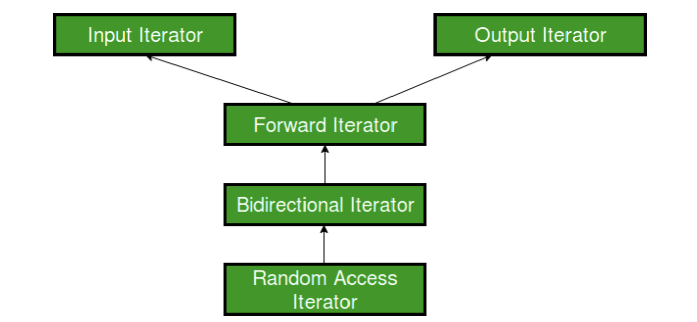

# iterator

Created: June 27, 2024 1:16 PM

https://www.geeksforgeeks.org/input-iterators-in-cpp/

# Iterator

*Five main types of iterators in C++ Standard Library (STL):*

- Input Iterator
- Output Iterator
- Forward Iterator
- Bidirectional Iterator
- Random-access Iterator

***Hierarchy Structure:***



# Input Iterator

## Salient Features

### Usability

Input iterators can be used **ONLY** with ***single-pass algorithms***

- Algorithms in which we can go to all the locations in the range at most once
- Like when we have to search or find any element in the range, we go through the locations at most once

### Equality / Inequality Comparison

An input iterator can be compared for equality with another iterator to check if they point to the same position

### Dereferencing

```cpp
*A       // Dereferencing using *
A -> m   // Accessing a member element m
```

### Increment-able

Using `operator++()` , it refers to the next element in the sequence.

**`*operator--()` CANNOT be used with INPUT ITER.*** 

- Remember, that input iterators are ***unidirectional*** and can only move in the forward direction.

```cpp
A++   // Using post increment operator
++A   // Using pre increment operator
```

### Swappable

The value pointed to by these iterators can be exchanged or swapped

## Practical Implementation

Input iterators are used:

- ONLY when we want access elements
- NOT when we want to assign elements to them

**std::find**

- To find the presence of an element inside a container

```cpp
// Definition of std::find() template  
InputIterator find (InputIterator first, InputIterator last,  
                    const T& val) 
{ 
    while (first!=last)  
    { 
        if (*first==val) return first; 
        ++first; 
    } 
    return last; 
} 
```

Used for ***single-pass algorithms***:

- Only we have to move sequentially and access the elements and check for equality with another element
- More examples: `std::equal`, `std::equal_range` and `std::count`

Example where we can’t use input iterators

- **std::copy**: as far as accessing elements are concerned, input iterators are fine, but as soon as we have to assign elements in another container, then we cannot use these input iterators for this purpose.

## Limitations

- Only accessing, no assigning
- Cannot be decremented, unidirectional
- Cannot use relational operator

```cpp
// If A and B are input iterators, then
A == B     // Allowed
A <= B     // Not Allowed
```

- Cannot use arithmetic operators

```cpp
// If A and B are input iterators, then
A + 1     // Not allowed
B - 2     // Not allowed
```

# Output Iterator

Perform the opposite function of input iterators:

- CAN be assigned values in a sequence
- CANNOT be used to access values

Input and Output iterators are complementary to each other

## Salient Features

### Usability

Output iterators can be used only with ***single-pass algorithms***

- algorithms in which we can go to all the locations in the range at most once, such that these locations can be dereferenced or assigned value only once

### Equality / Inequality Comparison

Output operators CANNOT be compared for equality with another iterator

```cpp
A == B  // Invalid - Checking for equality
A != B  // Invalid - Checking for inequality
```

### Dereferencing

Output iterator can be dereferenced as an lvalue to provide the location to store the value

```cpp
// A is an output iterator
*A = 1      // Dereferencing using *
A -> m = 7   // Assigning a member element m
```

### Increment-able

```cpp
A++   // Using post increment operator
++A   // Using pre increment operator
```

### Swappable

The value pointed to by these iterators can be exchanged and swapped

## Practical Implementation

Output iterators are used only when we want to assign elements and not when we have to access elements

**std::move**

- Used to move elements in a range into another range
- Since the result is the iterator to the resultant container, to which elements are assigned, so for this, we cannot use input iterators and have made use of output iterators at their place.
- Whereas for accessing elements, input iterators are used which only needs to be incremented and accessed.

```cpp
// Definition of std::move()
template 
OutputIterator move (InputIterator first, InputIterator last,
                     OutputIterator result)
{
    while (first!=last)
    {
        *result = std::move(*first);
        ++result;
        ++first;
    }
    return result;
}
```

## Limitations

- Only assigning, no accessing
    - We cannot access the output iterator as rvalue
    - Can only modify the element to which it points by being used as the target for an assignment
    
    ```cpp
    // C++ program to demonstrate output iterator 
    #include<iostream> 
    #include<vector> 
    using namespace std; 
    int main() 
    { 
        vector<int>v1 = {1, 2, 3, 4, 5}; 
      
        // Declaring an iterator 
        vector<int>::iterator i1; 
      
        for (i1=v1.begin();i1!=v1.end();++i1) 
        { 
            // Assigning elements using iterator 
            *i1 = 1; 
        } 
        // v1 becomes 1 1 1 1 1 
        return 0; 
    } 
    ```
    
    - The following is not allowed, since output iterators can only be the target in assignment.
        - However, if you try this piece of code, it will work, because vectors return iterators higher in hierarchy than output iterators
    
    ```cpp
    a = *i1 ; // where a is a variable
    ```
    
- Cannot be decremented, unidirectional
- Relational Operators not allowed at all

```cpp
// If A and B are output iterators, then

A == B     // Not Allowed
A <= B     // Not Allowed
```

- Arithmetic Operators not allowed

# Forward Iterator

Forward iterators are considered to be the combination of input and output iterators

- provide support to the functionality of both of them
- permits values to be both access and modified

## Salient Feature

# Bidirectional Iterator

# Random-access Iterator