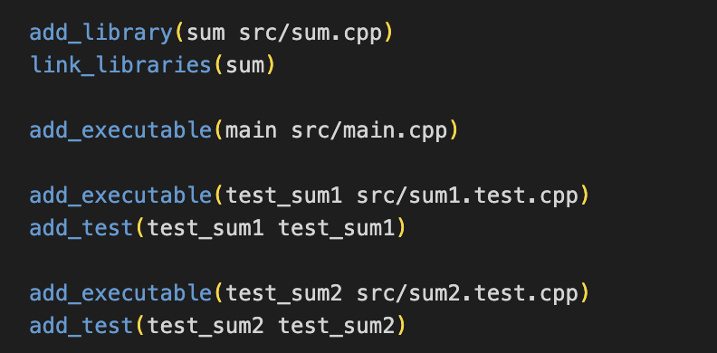

# w1lec1

Tags: lec
Status: Done

### first cpp program

```cpp
int getAge();
```

```cpp
#include <iostream>

#include "age.h"

int main()
{
    std::cout << getAge() << "\n";
}

int getAge()
{
    return 5;
}
```

```bash
g++ -o age age.cpp
./age
```

if we split the main function and getAge function:

```cpp
int getAge();
```

```cpp
#include <iostream>

#include "age.h"

int getAge()
{
    return 5;
}
```

```cpp
#include <iostream>

#include "age.h"

int main()
{
    std::cout << getAge() << "\n";
}
```

age_lib.cpp and age_main.cpp needed to be compiled together

```bash
g++ -o age age_lib.cpp age_main.cpp
./age
```

### sample for a bigger project

`std::endl` VS `\n`

when we print something, we print to the buffer instead of directly to the terminal, `std::endl` does flushing the buffer, which takes the buffer and dumps it all out on the terminal.

**use cmake to compile** 

let cmake write Makefile for the project

```bash
cmake -B build
```

get into the build directory

```bash
cd build
```

run Makefile to compile the main function

```bash
make main
```

run main

```bash
./main
```

**use catch2 to debug**

```cpp
#include <catch2/catch.hpp>

#include "sum.h"

TEST_CASE("sum1") {
    CHECK(sum(1, 2) == 3);
}
```

test files are something like a main file, 

to compile

```bash
make test_sum1
```

to run

```bash
./test_sum1
```

if we want to run all the test files, then

```bash
ctest
```

ALL test files will be run!!!

**why those lines work**

since those lines are written in CMakeLists.txt



**main file and library file**

if a file does not have a main function, it is a library file, else it is executable.