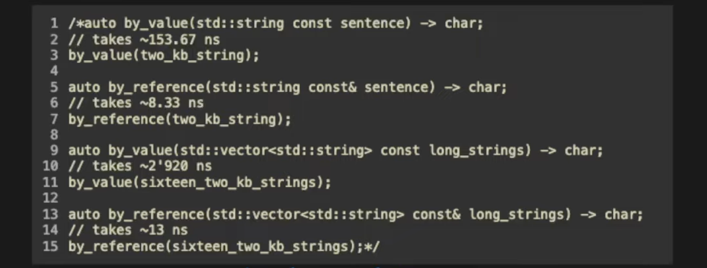

# w1lec2

Tags: lec
Status: In progress
contents: basic types: string, auto, const; expressions; value semantics; type conversion; functions: syntax, default arguments, overloading; sequenced collections; values & references; function passing method; declaration & definition; looping: for-range, for; enumeration; file i/o; error

## Basic Types

### string

```cpp
std::string course_code = std::string("comp6771");
std::string course_code = "comp6771";
```

### auto

allow compiler to statically infer the type of a variable based on what is being assigned  to it on the RHS

```cpp
int main() {
	auto i = 0; // i is an int
	auto j = 8.5; // j is a double
	auto k = false; // k is a bool
}
```

when we use auto on the LHS, std::string need to be added there.

```cpp
auto const course_code = std::string("comp6771");
```

### const

- specifies that a value cannot be modified
- ***const-correctness***
    - EVERYTHING should be const UNLESS it is needed to be modified in some cases
    - less run time when using

```cpp
int main() {
	 auto const meaning_of_life = 42;
	 // meaning_of_life++; // COMPILE ERROR HERE
}
```

## Expressions

### floating points

```cpp
#include <catch2/catch.hpp>

TEST_CASE()
{
    auto const x = 15.63;
    auto const y = 1.23;

    auto const sum = 16.86;
    CHECK(x + y == sum);

    auto const difference = 14.4;
    CHECK(x - y == difference);
    CHECK(y - x == -difference);

    auto const product = 19.2249;
    CHECK(x * y == product);

    auto const expected = 12.7073170732;
    auto const actual = x / y;
    auto const acceptable_delta = 0.0000001;
    // since we do something using cmath lib in catch2
    // it is not necessary for us to include cmath now after include catch2
    CHECK(std::abs(expected - actual) < acceptable_delta);
}
```

### strings

```cpp
auto const expr = std::string("Hello expressions!");  // expr std::string

// not enough information tells cpp we want this to be a string object
auto const expr = "Hello expressions!"; // expr char* const
```

```cpp
auto const expr = std::string("Hello expressions!");
auto const cxx = std::string("HellO C++!");

CHECK(expr != cxx); // they are not the same, true will ne returned

// .front return the first character in the string
CHECK(expr.front() == cxx[0]);
```

```cpp
// create a copy of string object, not a reference
auto expr2 = expr;
```

### booleans

```cpp
auto const is_comp6771 = true;
auto const is_about_cxx = true;
auto const is_about_german = false;

// and, or, not can be used in cpp 
// &&, ||, ! works as well
CHECK((is_comp6771 **and** is_about_cxx));
CHECK((is_about_german **or** is about_cxx));
CHECK(**not** is_about_german);

```

## Value Semantics

```cpp
#include <catch2/catch.hpp>

TEST_CASE()
{
    auto const hello = std::string("Hello!");
    
    // it is copied not just referenced
    auto hello2 = hello;

    // Abort TEST_CASE if expression is false
    // in cpp we compare stuff we compare the content inside, instead of reference
    REQUIRE(hello == hello2);

    hello2.append("2");
    REQUIRE(hello != hello2);

    CHECK(hello.back() == '!');
    CHECK(hello2.back() == '2');
}

```

## Type Conversions

Implicit promoting conversions

```cpp
auto const i = 0; // int
auto d = 0.0; // double

// silent conversion from int to double
d = i;
```

Explicit promoting conversions

```cpp
auto const i = 0;
// preferred over implicit, since intention is clear
// something with more abstractions
auto const d = sttaic_cast<double>(i);
```

## Functions

### syntax

modern function syntax in cpp

```cpp
// auto is something to make function creating more clear
// just syntax requirement
auto main() -> int
{
	std::count << "hello world!\n";
}
```

```cpp
int main() {
	std::count << "hello world!\n";
}
```

either can be used, but be CONSISTENT!!

### default arguments

```cpp
#include <string>

std::string rgb(short r = 0, short g = 0, short b = 0) {
	(void)r;
	(void)g;
	(void)b;
	return "";
}

int main(){
	rgb(); // rgb(0, 0, 0);
	rgb(100); // rgb(100, 0, 0);
	rgb(100, 200); // rgb(100, 200, 0);
	// rgb(100, ,200); // error
}
```

### function overloading

A family of functions in the same scope that have the same name but different formal parameters

```cpp
auto square(int const x) -> int
{
	return x * x;
}

auto square(double const x) -> double
{
	return x * x;
}
```

Process of function matching:

1. Find candidate functions: Same name
2. Select viable ones: Same number arguments + each argument convertible
3. Find a best-match: Type much better in at least one argument

When writing code, try and only create overloads that are trivial.

- if not, name functions differently

## Sequenced Collections

vector: basic sequenced container

- super array - array with some helpful methods

```cpp
auto const single_digits = std::vector<int> {
	0, 1, 2, 3, 4, 5, 6, 7, 8, 9
};

auto more_single_digits = single_digits;
REQUIRE(single_digits == more_single_digits);

more_single_digits[2] = 0;
CHECK(single_digits != more_single_digits);

more_single_digits.push_back(0);
CHECK(more_single_digits.size() == 11);
```

## Values & References

A reference is an ***alias*** for another object

- can use it as you would as the original object
- similar to pointer, BUT
    - DO NOT need to use → to access elements
    - CANNOT be `null`
    - CANNOT change what they refer to once set

```cpp
auto i = 1;

// k is a copy of the content in i
auto k = i;

// j is just an alias of i
auto& j = i;

j = 3;

CHECK(i == 3);
```

A reference to const means you can’t modify the object using the reference.

The object is still able to be modified, just not through this reference.

```cpp
auto i = 1;
auto const& ref = i;
std::cout << ref << '\n';

i++; // this is fine
std::cout << ref << '\n';

// ref++; // this will leads to an error
```

```cpp
auto const j = 1;
auto const& jref = j; // this is allowed

// auto& ref = j; // not allowed

std::cout << jref << '\n';
```

## Function passing methods

cpp pass by **value**

```cpp
#include <iostream>

auto swap(int x, int y) -> void
{
	auto const tmp = x;
	x = y;
	y = tmp;
}

auto main() -> int
{
	auto i = 1;
	auto j = 2;
	std::cout << i << ' ' << j << '\n'; // prints 1 2
	swap(i, j);
	
	// not swapoed?
	std::cout << i << ' ' << j << '\n'; // prints 1 2 
}
```

We manually pass by **reference**

```cpp
auto swap(int& x, int& y) -> void
{
	auto const tmp = x;
	x = y;
	y = tmp;
}

auto main() -> int
{
	auto i = 1;
	auto j = 2;
	swap(i, j);
}
```

comparing value and reference performance



## Declarations VS Definitions

***Declaration:*** makes known the type and the name of a variable

***Definition***: a declaration with extra things

- A variable definition allocates storage for, and constructs a variable
- A class definition allows you to create variables of the class type
- You can call functions with only a declaration, but must provide a definition later

Everything MUST have precisely one definition

```cpp
void declared_fn(int arg);
class declared_type;

// this class is defined, but not all the methods are
class defined_type {
	int declared_member_fn(double);
	int defined_member_fn(int arg) { return arg; }
};

// these are all defined
int defined_fn(int arg) {
	(void)arg;
	return 1;
}

TEST_CASE() {
	// declaration
	int i;
	
	// definitions
	int const j = 1; // allocation memory and assign value
	auto vd = std::vector<double> {}; // create an empty vector object
	
}
```

## Looping

### for-range statements

```cpp
#include <string>
#include <vector>

auto all_computer_scientists(std::vector<std::string> const& names) -> bool
{
	auto const famous_mathematician = std::string("Gauss");
	auto const famout_physicist = std::string("Newtown");
	
	// mostly const reference here
	for (auto const& name : names) {
		if (name == famout_mathematician or name == famous_physicist) {
			return false;
		}
	}
	return true;
}
```

### for statements

similar to c syntax

```cpp
auto square(int n)
{
    return n * n;
}

auto cube(int n)
{
    return n * n * n;
}

auto square_vs_cube() -> bool
{
    // 0 and 1 are special cases, since they're actually equal.
    if (square(0) != cube(0) or square(1) != cube(1)) {
        return false;
    }

    for (auto i = 2; i < 100; ++i) {
        if (square(i) == cube(i)) {
            return false;
        }
    }

    return true;
}
```

## Enumarations

```cpp
#include <catch2/catch.hpp>

TEST_CASE()
{
    enum class computing_courses {
        intro,
        data_structures,
        engineering_design,
        compilers,
        cplusplus,
    };

    auto const computing101 = computing_courses::intro;
    auto const computing102 = computing_courses::data_structures;
    CHECK(computing101 != computing102);
}
```

## File I/O

quite similar to std::cout and std::cin

```cpp
#include <fstream>
#include <iostream>

int main()
{
    // Below line only works C++17
    std::ofstream fout { "data.out" };
    if (auto in = std::ifstream { "data.in" }; in) { // attempts to open file, checks it was opened
        for (auto i = 0; in >> i;) { // reads in
            std::cout << i << '\n';
            fout << i;
        }
        if (in.bad()) {
            std::cerr << "unrecoverable error (e.g. disk disconnected?)\n";
        } else if (not in.eof()) {
            std::cerr << "bad input: didn't read an int\n";
        }
    } // closes file automatically <-- no need to close manually!
    else {
        std::cerr << "unable to read data.in\n";
    }
    fout.close();
}
```

## Program errors