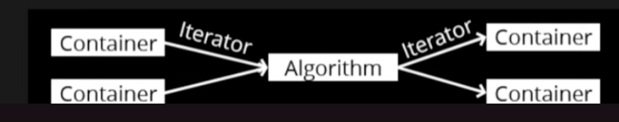

# w2lec1

Tags: lec
Status: Done
contents: STL: basic container iteration, sequential containers, ordered associative container, unordered associative container, container performance

# Standard Template Library (STL)

- All components of STL are templates
- Containers store data, but don’t know about the algorithms
- Iterators are API to access items within a container in a particular order, agnostic of the container used
    - each container has its own iterator type
- Algorithms manipulate values referenced by iterators, but don’t know about containers



iterator is something works with both containers and algorithms

## Basic container iteration

```cpp
#include <array>
#include <iostream>

int main() {
    // std::array<type, size>
    // c++ style with container,
    // it has iterators, safe access and it doesn't act like a pointer
    auto ages = **std::array<int, 3>**{18, 19, 20};
}
```

**size method**

```cpp
// age.size() will return an unsigned int, 
// it in not a normal int, instead that is an int never can be negative
// so if we define i as a normal int, the compiler will give us a warning and 
// no compilation will be made
for (**unsigned int** i = 0; i < ages.size(); ++i) {
    std::cout << ages[i] << "\n";
}

// age.size() will actually return a type called std::size_t in cpp
for (auto i = **std::size_t{0}**; i < ages.size(); ++i) {
    std::cout << ages[i] << "\n";
}
```

**iterators**

```cpp
// ages.begin() will return an iterator
// an iterator behaves like a pointer with some cool features, 
// but not in exactly the same way as a pointer
for (auto it = ages.begin(); it != ages.end(); ++it) {
    // *it dereference the address stored in it
    std::cout << *it << "\n";
}
```

**range loop - short hand**

```cpp
for (auto age : ages) {
		age++;
    std::cout << age << "\n";
}
```

## Sequential containers


### std::vector

```cpp
#include <iostream>
#include <vector>

int main() {
    auto numbers = std::vector<int> {1, 2, 3};
    int input;

    // std::cin use white space to separte things
    // will loop until we enter something is not an int or something like ctrl+D
    while (std::cin >> input) {
        numbers.push_back(input);
    }

    // slower, safer
    // since it will have a check on iterator we throw to it and have exceptions
    std::cout << "1st element: " << numbers.at(0) << "\n";
    // faster, less safe  
    std::cout << "2nd element: " << numbers[1] << "\n";
}
```

dynamically resizable

```cpp
// resize dynamically 3->6->12 ...
std::cout << "max size before realloc: " << numbers.capacity() << "\n";
for (auto n : numbers) {
    std::cout << n << "\n";
}
```

## Ordered associative containers


- data structure: tree

### std::map

**insert**

```cpp
#include <iostream>
#include <map>
#include <string>

int main() {
    std::map<std::string, double> m;

    // insert function takes in a key-value pair
    std::pair<std::string, double> p1 {"bat", 14.75};
    m.insert(p1);

    // compiler will automatically construct values as required
    // when it knows the required typw
    m.insert({"cat", 10.157});

    // preferred way to useing a map
    m.emplace("cat", 10.157);
}
```

**find**

<aside>
💡 **Why we need find method instead of using a general searching algorithm for everything?**

*→ COMPLEXITY!!!! since it knows the structure of the tree, it can do a much quic ker find.*

</aside>

```cpp
// iterator to bat if present,
// otherwise m.end()
auto it = m.find("bat");
```

## Unordered associative containers


- data structure: truly a hash map

map VS unordered_map

- map.find(): map is stored as a tree, so that is logarithmic in the size of the container
- unordered_map: Key should be hashable

## Container Performance

