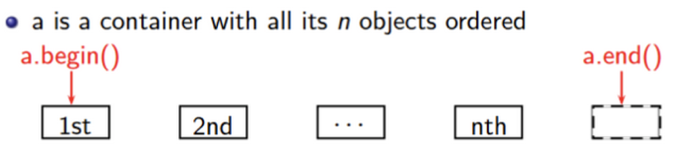

# w2lec2

Tags: lec
Status: Done
contents: STL iterators; STL algorithms

# STL Iterators

- Iterator is an abstract notion of a pointer
- Iterators are types that abstract container data as a sequence of objects (i.e. linear)
- Iterators will allow us to connect a wide range of containers with a wide range of algorithms via a common interface

## Explanation

***a.beigin()***: abstractly “points” to the first element

***a.end()***: abstractly “points” to one past the last element

- NOT AN INVALID iterator value

If iter abstractly points to the k-th element, then:

- `*p` is the object it abstractly points to
- `++p` abstractly points to the (k+1)-st element



```cpp
int main() {
    auto names = std::vector<std::string> {"abc", "acd", "acb"};
    for (auto iter = names.begin(); iter != names.end(); ++iter) {
        std::cout << *iter << "\n";
    }

    for (std::vector<std::string>::iterator iter = names.begin(); iter != names.end(); ++iter) {
        std::cout << *iter << "\n";
    }
}
```

### **Address**

```cpp
// std::cout << iter << "\n";  
// error, since cpp doesn't know how to change this to a string

// print out the address of iterator instead of the address of a certain ele in vector
std::cout << &iter << "\n";
```


vector iterator is actually an object that contains a pointer points to the element, but it includes something else as well.


so when we dereference by `*p` what happens in the object is calling a function to find the pointer and dereference it


**correct way to get the address of elements!!!**

```cpp
std::cout << &(*iter) << "\n";
```

## Constness & Reverse

`vec.rend()` is not the same as `vec.begin()`


```cpp
int main() {
    auto ages = std::vector<int> {};
    ages.push_back(18);
    ages.push_back(19);
    ages.push_back(20);

    // type of iter would be std::vector<int>::iterator
    for (auto iter = ages.begin(); iter != ages.end(); ++iter) {
        (*iter)++; // OK
    }

    // type of iter would be std::vector<int>::const_iterator
    for (auto iter = ages.cbegin(); iter != ages.cend(); ++iter) {
        // (*iter)++;  // ERROR since it is const, it cannot be modified
    }

    // type of iter would be std::vector<int>::reserve_iterator
    for (auto iter = ages.rbegin(); iter != ages.rend(); ++iter) {
        std::cout << *iter << "\n";  // 20, 19, 18
    }
}
```

***There is difference between iterator is a const and const_iterator***

- so when using const_iterator, we can still use ++ on iterator (i.e. `++iter`), but
- we can’t modify the element the iterator referred to

## Iterator validation

For std::erase(), we need to pass an iterator to delete something

```cpp
int main() {
    auto vec = std::vector<std::string> {"a", "b", "c"};
    auto it = vec.begin();
    it++;
    vec.erase(it);

    for (auto const& item : vec) {
        std::cout << item << "\n";
    }
}
```

After we delete something, iterator will shift everything forward and jumping

```cpp
int main() {
    auto vec = std::vector<int> {1, 2, 4, 5, 5, 6, 7, 8};

    // remove all even elements
    // <= works here just because we happen to have continuous memory
    // if it is a map, it might not work any more
    for (auto it = vec.begin(); it <= vec.end(); ++it) {
        if (*it % 2 == 0) {
            vec.erase(it);
        } 
    }

    for (auto const& item : vec) {
        std::cout << item << " ";
    }
    std::cout << "\n";
}
```


```
1 2 4 5 5 6 7 8 E
^ not even -> move up one
  ^ even -> delete it, shift forward and move up one
1 4 5 5 6 7 8 E
		^ thats why we miss 4
  
```

***How to do that?***

```cpp
int main() {
    auto vec = std::vector<int> {1, 2, 4, 5, 5, 6, 7, 8};

    auto it = vec.begin();
    while (it != vec.end()) {
        if (*it % 2 == 0) {
            it = vec.erase(it);
        } else {
            ++it;
        }
    }

    for (auto const& item : vec) {
        std::cout << item << " ";
    }
    std::cout << "\n";
}
```

# STL Algorithms

STL algorithms works directly on iterators instead of containers

***simple example with accumulate STL algorithm***

```cpp
// example: using accumulate stl algo to sum things up
int main() {
    auto nums = std::vector<int> {1, 2, 3, 4, 5};
    int sum = std::accumulate(nums.begin(), nums.end(), 0);
    std::cout << sum << "\n";
}
```

### **accumulate (next, distance)**

```cpp
int main() {
    auto v = std::vector<int> {1, 2, 3, 4, 5};
    // 0 is the initial value when summing nums up
    int sum = std::accumulate(v.begin(), v.end(), 0);

    // std::multiplies<int>() changes the binary operation
    // them we multiply those nums
    int product = std::accumulate(v.begin(), v.end(), 1, std::multiplies<int>());
    std::cout << "product: " << product << "\n";

    // get the midpoint
    auto midpoint = v.begin() + static_cast<int>(v.size() / 2);
    (void) midpoint;
    // thats too hard to read --> make it simpler
    // std::distance are counting how many steps there are between the starting point and end point given
    auto midpoint_easy = std::next(v.begin(), std::distance(v.begin(), v.end()) / 2);
    (void) midpoint_easy;

    int sum2 = std::accumulate(v.begin(), midpoint, 0);

    std::cout << sum << " " << sum2 << "\n";
}
```

### **find**

```cpp
int main() {
    auto nums = std::vector {1, 2, 3, 4, 5};

    auto it = std::find(nums.begin(), nums.end(), 4);

    if (it != nums.end()) {
        std::cout << "Found it!" << "\n";
    }
}
```

### **bound**

```cpp
#include <algorithm>
#include <iostream>
#include <list>
#include <vector>

int main() {
    // lower bound does a binary search, and
    // returns the first value >= the argument
    auto sortedVec = std::vector<int> {1, 2, 3, 4, 5, 6, 7, 8, 9, 10};
    (void)std::lower_bound(sortedVec.begin(), sortedVec.end(), 5);

    auto sortedLinkedList = std::list<int> {1, 2, 3, 4, 5, 6, 7, 8, 9, 10};
    (void)std::lower_bound(sortedLinkedList.begin(), sortedLinkedList.end(), 5);
}
```

## **Performance and Portability**

Consider:

- number of comparisons for binary search on a vector is $O(log N)$
- number of comparisons for binary search on a linked list is $O(N logN)$
- two implementations are completely different

BUT we call the same function on both of them, then it will end up calling a function has two overloads

- one for a forward iterator
- one for a random access iterator

## Iterator Categories


## Output Sequence Algorithm

```cpp
#include <iostream>
#include <vector>

char to_upper(unsigned char value) {
    return static_cast<char>(std::toupper(static_cast<unsigned char>(value)));
}

int main() {
    auto s = std::string("Hello World");
    // algo like transform, which has output iterators,
    // use the other iterator as an output
    auto upper = std::string(s.size(), '\0');
    std::transform(s.begin(), s.end(), upper.begin(), to_upper);
}
```

### back inserter

```cpp
#include <iostream>
#include <vector>

char to_upper(char value)
{
    return static_cast<char>(std::toupper(static_cast<unsigned char>(value)));
}

int main()
{

    std::string s = "hello world";
    // std::for_each modifies each element
    std::for_each(s.begin(), s.end(), toupper);

    std::string upper;
    // std::transform adds to third iterator.
    std::transform(s.begin(), s.end(), std::back_inserter(upper), to_upper);
}

```

## Lambda

A function that can be defined inside other functions

```cpp
[capture] (parameters) -> return {
	bool
}
```

```cpp
[](card const c) -> bool {
	return c.colour == 4;
}
```

```cpp
#include <iostream>
#include <vector>

int main()
{
    std::string s = "hello world";
    // std::for_each modifies each element
    std::for_each(s.begin(), s.end(), [](char& value) { value = static_cast<char>(std::toupper(value)); });
}

```