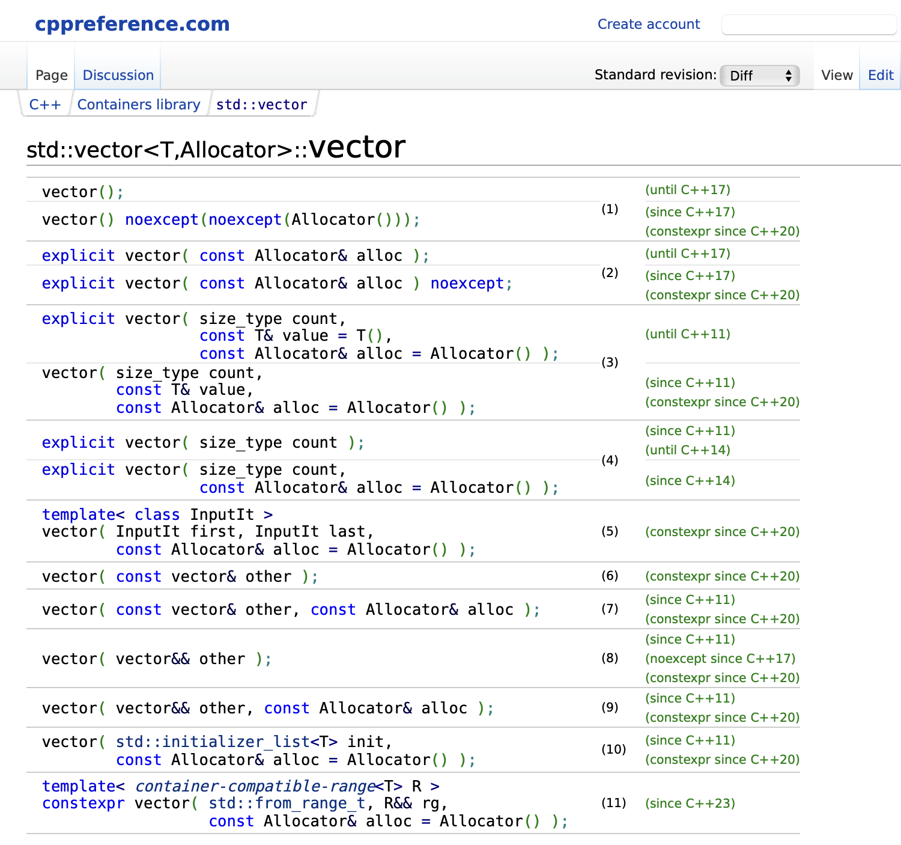

# w3lec

Tags: lec
Status: Done
contents: scope; namespaces; OOP: member access control, constructor, destructor, this (pointer), class scope, incomplete types,  classes & structs, explicit, const members, static members, defaults

# Scope

The scope of a variable is the part of the program where it is accessible

- scope starts at variable declaration
- scope usually ends at next “}”

```cpp
int main() {
	int i = 0;
	for (int j = 0; j < 10; j++) {
		// something ...
	}
	
	// DOES NOT WORK, since j is defined inside the loop
	// and compiler does not know what j is at this point
	printf("%d", j);
	
	return i;
}

// NOT WORKING, since it doesnt know what i is
printf("%d\n", i);
```

Define variables as close to first usage as possible

- there is no universal rule for this, but for higher level language this would be a better practice

```cpp
int main() {
	int i = 0;
	
	// int k = i + 1; // BETTER NOT DO THIS
	
	for (int j = 0; j < 10; j++) {
		**// define variables as late as possible**
		int k = i + 1; // PREFERRED
		printf("%d\n", k);
	}
	
	return i;
}
```

```cpp
#include <iostream>

int i = 1;
int main()
{
	std::cout << i << "\n"; // 1
	if (i > 0) {
		int i = 2;
		std::cout << i << "\n"; // 2
		{
			// int i = 3;
			int i;
			std::cout << i << "\n";
		}
		std::cout << i << "\n"; // 2
	}
}
```

Ways we create scopes:

- Classes
- Namespaces
- Functions
- Global
- Random braces

## Object Lifetimes

An object is a piece of memory of a specific type that holds some data

- ALL variables are objects in c++

Object lifetime starts when it comes in scope

- “Constructs” the object
- Each type has 1 or more constructor that says how to construct it

Object lifetime ends when it goes out of scope

- “Destructs” the object
- Each type has a different “destruct” which tells the compiler how to destroy it

## Construction

Construction describes the process of allocating the memory and setting up for the creation of an object

```cpp
#include <vector>

auto main() -> int
{
	auto v1 = std::vector<int> {1, 2};
	auto v2 = v1;
}
```

Constructions can happen in different ways

https://en.cppreference.com/w/cpp/container/vector/vector



```cpp
#include <vector>

auto main() -> int
{
    std::vector<int> v11; // call 0-argument constructor, creates empty vector

    // there's no difference between these:
    // T variable = T{arg1, arg2, ...}
    // T variable{arg1, arg2, ...}
    auto v12 = std::vector<int> {}; // no different to the first
    auto v13 = std::vector<int>(); // no different to the first

    {
        auto v2 = std::vector<int> { v11.begin(), v11.end() }; // a copy of v11
        auto v3 = std::vector<int> { v2 }; // a copy of v2
    } // v2 and v3 destructors are called here
		// v2 and v3 cannot be called here, since they have been destructed

    auto v41 = std::vector<int> { 5, 2 }; // initialiser-list constructor {5, 2}
    auto v42 = std::vector<int>(5, 2); // count + value constructor (5 * 2 => {2, 2, 2, 2, 2})
} // v11, v12, v13, v41, v42 destructors called here
```

### **Construction Parentheses**

Generally use () to call functions, and to construct objects

- () can only be used for functions, and can be used for either
- these are some rare occasions these are different
    - sometimes it is ambiguous between a constructor and an initialise list

```cpp
#include <vector>
#include <iostream>

auto f() -> double
{
    return 1.1;
}

auto main() -> int
{
    // one of the reasons we do auto is to avoid uninitialised values
    // int n;  // not initialised (memory contains previous value)

    int n21 {}; // default constructor (memory contains 0)
    auto n22 = int {}; // default constructor (memory contains 0)
    auto n3 { 5 }; // create an int with value 5

    // obvious you know that f() is not an int, but the compiler lets it through
    // int n43 = f();

    // not obvious you know that f() is not an int, and the compiler wont let you (narrowing conversion)
    // auto n41 = int{f()};

    // Good code. Clear you understand what you are doing
    auto n42 = static_cast<int>(f());

    // std::cout << n << "\n"
    std::cout << n21 << "\n";
    std::cout << n22 << "\n";
    std::cout << n3 << "\n";
    std::cout << n42 << "\n";
}
```

### **The usefulness of object lifetimes**

```cpp
#include <algorithm>
#include <fstream>
#include <string>
#include <vector>

auto ReadWords(const std::string& filename) -> void
{
    std::ifstream f { filename };
    std::vector<std::string> words;
    std::copy(std::istream_iterator<std::string> { f }, {}, std::back_inserter(words));
    f.close();
}
```

We can put `f.close()` into the destructor function, then we don’t need to reply on manual closing action by unreliable programmer any more. Instead when f goes out of scope, it will be automatically closed by destructor.

# Namespaces

Used to express that names belong together

```cpp
// lexicon.hpp
namespace lexicon {
std::vector<std::string> read_lexicon(std::string const& path);
void write_lexicon(std::vector<std::string> const&, std::string const&)
} // namespace lexicon
```

```cpp
// To use the namespace, we simply just use double colons ::
lexicon::read_lexicon
```

Prevent similar names from clashing

```cpp
// word_ladder.hpp
namespace word_ladder {
std::unordered_Set<std::string> read_lexicon(std::string const& path);
} // namespace word_ladder
```

We can also nest them, but we try and use top level instead of nesting where we can.

```cpp
namespace comp6771::word_ladder {
std::vector<std::vector<std::string>> word_ladder(std::string const& from, std::string const& to);
} // namespace comp6771::word_ladder
```

```cpp
namespace comp6771{
// ...
namespace word_ladder {
	std::vector<std::vector<std::string>> word_ladder(std::string const& from, std::string const& to);
} // namespace word_ladder
} // namespace comp6771
```

We can create ***unnamed namespaces*** to provide a similar capability as C when it comes to functions local to a file. And we can also nest them.

- this can be useful when we need a file scope in cpp, something like static in java
- for some language like python, nodeJS, …, there is a file scope. After import a file, we still can’t touch the variables in that file
- in c, cpp, after #include, the files got linked together, everything in those files become achievable for each other, what is just like copying and pasting all codes in another

```cpp
namespace word_ladder {
namespace {
	bool valid_word(std::string const& word);
} // namespace
} // namespace word_ladder
```

We can also use ***namespace aliases*** to give a namespace a new name. It’s often great for shortening nested namespaces.

```cpp
namespace chrono = std::chrono;
```

It’s important to always ***fully-qualify*** your namespaces even if you’re already in that namespace.

```cpp
namespace word_ladder {
namespace {
    bool valid_word(std::string const& word);
} // namespace

std::vector<std::vector<std::string>>
generate(std::string const& from, std::string const& to)
{
    // ...
    auto const result = word_ladder::valid_word(word);
    // ...
}
} // namespace word_ladder
```

# Object-Oriented Programming

## **Member Access Control**

This is how we support encapsulation and information hiding in C++

```cpp
class foo {
public:
    // members accessible by everyone
    foo(); // the default constructor

protected:
    // members accessible by members, friend and subclass
    // will discuss this when we do advanced OOP in future

private:
    // accessible only by members and friends
    void private_member_function();
    int private_data_member_;

public:
    // may define multiple sections of the same name
    // we can do this but it is not a good practice
};
```

## Constructors

```cpp
#include <iostream>

class myclass {
public:
    myclass(int i)
    {
        i_ = i;
    }
    int getval()
    {
        return i_;
    }

private:
    int i_;
};

int main() 
{
		// create an object of myclass Class
    auto mc = myclass { 1 };
    std::cout << mc.getval() << "\n";
}
```

### **Constructor Initialiser List**

The initialisation phase occurs before the body of the constructor is executed, regardless of whether the initialiser list is supplied.

A constructor will:

1. Construct all data members in order of member declaration (using the same rules as those used to initialise variables)
2. Construct any undefined member variables that weren’t defined in step (1)
3. Execute the body of constructor: the code may assign values to the data members to override the initial values

```cpp
#include <iostream>
#include <string>

class myclass {
public:
    **myclass(int i, int j, int k)**
			  // initialiser list
        **: i_ { i }, j_ { j }, k_ { k }**
    {
        std::cout << "CONSTRUCTED!\n";
    }
    int getVal()
    {
        (void) j_;
        (void) k_;
        return i_;
    }
private:
    int i_;
    int j_;
    int k_;
};

int main()
{
    auto mc = myclass { 5, 6, 7 };
    std::cout << mc.getVal() << "\n";
}
```

Based on what we achieve at the last point, the following is the same as the constructor initialiser list. But if we do as shown below, we need to do default construct on int i, j, k, i_, j_, k_ first and then copy the value from i, j, k to i_, j_, k_. ***With initialiser list, i_, j_, k_ will never be default constructed***, instead it will directly copy the value in i, j, k when construct those variable. 

```cpp
#include <iostream>
#include <string>

class myclass {
public:
   **** myclass(int i, int j, int k)
    {   
        **i_ = i;
        j_ = j;
        k_ = k;**
        std::cout << "CONSTRUCTED!\n";
    }
    int getVal()
    {
        (void) j_;
        (void) k_;
        return i_;
    }
private:
    int i_;
    int j_;
    int k_;
};

int main()
{
    auto mc = myclass { 5, 6, 7 };
    std::cout << mc.getVal() << "\n";
}
```

### **Constructor Logic Summary**

- Constructors define how class data members are initialised
- A constructor has the same name as the class and no return type
- Default initialisation is handled through the default constructor
- Unless we define our own constructors the compiler will declare a default constructor
    - known as the synthesised default constructor

```cpp
for each data member in declaration order
if it has an used defined initialiser
	Initialise it using the used defined initialiser
else if it is of a built-in type (numeric, pointer, bool, char, etc.)
	do nothing (leave it as whatever was in memory before)
else
	Initialise it using its default constructor
```

```cpp
#include <iostream>
#include <string>

class myclass {
public:
    myclass(std::string s)
        : s_ { s }
    {
    }
    std::string getval()
    {
        return s_;
    }

private:
    // compiler find s_ in initialiser list, so it will construct by copying string s
    std::string s_;
    // not mentioned in initialiser list, but it is a primitive type, then default (leave it)
    int i_;
    // not in initialiser list and not a primitive type, we will call the dafault constructor
    std::string j_;
};
```

### **Delegating Constructors**

A constructor may call another constructor inside the initialiser list

- Since the other constructor must construct all the data members, do not specify anything else in the constructor initialiser list
- The other constructor is called completely before this one
- This is one of the few good uses for default values in C++
    - Default values may be used instead of overloading and delegating constructors

```cpp
#include <string>

class dummy {
public:
    explicit dummy(int const& i)
        : s_ { "Hello world!" }
        , val_ { i }
    {
    }
    // what we do here is set a shorthand for create dummy object with a default value 5
    // i.e. if we don't pass any integers when creating a object, if will use 5 to create one
    explicit dummy()
        : dummy(5)
    {
    }
    std::string const& get_s()
    {
        return s_;
    }
    int get_val()
    {
        return val_;
    }
private:
    std::string s_;
    const int val_;
};

auto main() -> int
{
    dummy d1(5);
    dummy d2 {};
}
```

## Destructors

Called when the object goes out of scope

***Why might destructors be handy?***

- Free pointers
- Close files
- Unlock mutexes (from multithreading)
- Abort database transactions

Noexcept states no exception will be thrown

```cpp
class MyClass {
	// ~MyClass() {
	//   // definition goes here
	// }
	
	// We can directly define the deconstructor here,
	// But it would be common to do that in a seperate file
	
	~MyClass();
}
```

```cpp
**// REMEMBER TO MENTION SCOPE**
**MyClass::**~MyClass()
{
	// Definition here
}
```

## This Pointer

A member function has an extra implicit parameter, named *this*

- *This* is a pointer to the object on behalf of which the function is called
- A member function does not explicitly define it, but may explicitly use it
- The compiler treats an unqualified reference to a class member as being made through the *this* pointer
- Generally we use a “_” suffix for class variables rather than a *this→* to identify them

```cpp
#include <iostream>

class myclass {
public:
    myclass(int i)
    {
        i_ = i;
    }
    int getval()
    {
        return i_;
    }
private:
    int i_;
};
```

```cpp
#include <iostream>

class myclass {
public:
    myclass(int i)
    {
        this->i_ = i;
    }
    int getval()
    {
        return this->i_;
    }
private:
    int i_;
};
```

## Class Scope

Anything declared inside the class needs to be accessed through the scope of the class

- Scopes are accessed using “::” in C++

```cpp
// foo.h
#include <istream>

class Foo {
public:
    using Age = int;

    Foo();
    Foo(std::istream& is);
    ~Foo();

    void member_function();
};
```

```cpp
// foo.cpp
#include "tmp.h"

Foo::Foo()
{
}

Foo::Foo(std::istream& is)
{
}

Foo::~Foo()
{
}

void Foo::member_function()
{
    Foo::Age age;
    
    // also valid, since we are inside the Foo scope
    Age age;
}
```

Why we prefer to put definition in a separate file?

- If we put all definitions in .h header file, it means for every file #include this header file will copy and paste this super long file into its file.
    - which will not slow down the program, but will slow down the compilation
- If we have a separate cpp file, it will only compile once and get linked at the end

```cpp
#include <iostream>
#include <string>

class person {
public:
    person(std::string const& name, int const age);
    auto get_name() -> std::string const&;
    auto get_age() -> int const&;

private:
    std::string name_;
    int age_;
};

person::person(std::string const& name, int const age)
{
    name_ = name;
    age_ = age;
}

auto person::get_name() -> std::string const&
{
    return name_;
}

auto person::get_age() -> int const&
{
    return age_;
}

auto main() -> int
{
    auto p = person { "Hayden", 99 };
    std::cout << p.get_name() << "\n";
}
```

## Incomplete Types

An incomplete type may only be used to define pointers and references, and in function declarations (but not definitions),

Because of the restriction on incomplete types, a class cannot have data members of its own type

```cpp
struct node {
	int data;
	// Node is incompelete - this is invalid
	// This would also make no sense. What is sizeof(node)
	node next;
}
```

But the following is legal, since a class is considered declared once its class name has been seen

```cpp
struct node {
	int data;
	node* next;
}
```

## Classes & Structs

A class and a struct in C++ are almost exactly the same

The ***only difference*** is that:

- All members of a struct are public by default
- All members of a class are private by default

We use structs only when we want a simple type with little or no methods and direct access to the data members (as a matter of style)

- This is a semantic difference, not a technical one
- A std::pair or std::tuple may be what you want

```cpp
class foo { int member_ };
```

```cpp
struct foo { int member_ };
```

## Explicit Keyword

If a constructor for a class has 1 parameter, the compiler will create an implicit type conversion from the parameter to the class

This may be the behaviour you want (but usually not), you have to opt-out of the implicit type conversion with the explicit keyword

```cpp
#include <iostream>

class age {
public:
    age(int age)
        : age_ { age }
    {
    }

    auto getAge() { return age_; }
private:
    int age_;
};

auto main() -> int
{
    // explicitly calling the constructor
    age a1 { 20 };

    // explicitly calling the constructor
    age a2 = age { 20 };

    // since we are assigning an int to an object here,
    // the compiler will attempt to use the integer as an argument to create an object,
    // and the type of parameter matched, so an age object is created successfully here
    // implicit conversion done
    age a3 = 20;

    (void)a1;
    (void)a2;
    std::cout << a3.getAge() <<"\n";
}
```

But if we put ***explicit*** before age, `age a3 = 20;` will not work then

```cpp
#include <iostream>

class age {
public:
		// have explicit here is to set implicit conversion not allowed
    **explicit** age(int age)
        : age_ { age }
    {
    }

    auto getAge() { return age_; }
private:
    int age_;
};

auto main() -> int
{
    **// age a3 = 20; // error returned**
}
```

***Having explicit for every function in class is recommended***

## Const Members

Member functions are by default only callable by non-const objects

- You can declare a const member function which is valid on const objects and non-const objects
- A const member function may only modify mutable members
    - A mutable member should mean that the state of the member can change without the state of the object changing
    - Mutable is not something you should set lightly
    - One example where it might be useful is cache

```cpp
#include <iostream>
#include <string>

class person {
public:
    person(std::string const& name)
        : name_ { name }
    {
    }
    auto set_name(std::string const& name) -> void
    {
        name_ = name;
    }
    auto get_name() -> std::string const&
    {
        return name_;
    }

private:
    std::string name_;
};

auto main() -> int
{
    person p1 { "Hayden" };
    p1.set_name("Chris");
    std::cout << p1.get_name() << "\n";

    person const p2 { "Hayden" };
    // p2.set_name("Chris"); // WILL NOT WORK... WHY NOT?
    // std::cout << p2.get_name() << "\n"; // WILL NOT WORK... WHY NOT?
}
```

Why get_name() function doesn’t work here, even it doesn’t make any changes on variables?

- Since after we set an object to be const, it will only search for the function with a const in function declaration and run that, otherwise it will throw an error

<aside>
💡 ***const object can only call a const function***

</aside>

```cpp
#include <iostream>
#include <string>

class person {
public:
    person(std::string const& name)
        : name_ { name }
    {
    }
    auto set_name(std::string const& name) -> void
    {
        name_ = name;
    }
    
    // auto set_name(std::string const& name) const -> void
    // {
	  //     name_ = name;
    // }
    
    **// For a const function, it would be happy to be call for const object and non-const object
    // So we should set as much functions to be const as possible**
    auto get_name() const -> std::string const&
    {
        return name_;
    }

private:
    std::string name_;
};

auto main() -> int
{
    person p1 { "Hayden" };
    p1.set_name("Chris");
    std::cout << p1.get_name() << "\n";

    person const p2 { "Hayden" };
    // p2.set_name("Chris"); // WILL NOT WORK... WHY NOT?
	  std::cout << p2.get_name() << "\n"; // WILL NOT WORK... WHY NOT?
}
```

In this case get_name function will work for p2.

But even if we create a const set_name function, it will still throw an error, since we are trying to make some changes on variables in a const function.

<aside>
💡 ***Mark as many functions const as possible***

</aside>

## Static Members

Static members belong to the class (i.e. every object), as opposed to a particular object

These are essentially globals defined inside the scope of the class

- Use static members when something is associated with a class but not a particular instance
- Static data has global lifetime (program start to program end)

```cpp
#include <string>

class user {
public:
    user(std::string const& name)
        : name_ { name }
    {
    }
    auto valid_name(std::string const& name) -> bool
    {
        return name.length() < 20;
    }

private:
    std::string name_;
};

auto main() -> int
{
    auto n = std::string{ "Santa Clause" };
    auto u = user { n };
    if (u.valid_name(n)) user user1 { n };
}

```

```cpp
#include <string>

class user {
public:
    user(std::string const& name)
        : name_ { name }
    {
    }
    **static** auto valid_name(std::string const& name) -> bool
    {
        return name.length() < 20;
    }

private:
    std::string name_;
};

auto main() -> int
{
    auto n = std::string{ "Santa Clause" };
    // we would call the function on the class not an instance
    if (**user::valid_name(n)**) {
        user user1 { n };
    }
}
```

## Defaults

### **The synthesised default constructor**

- Is generated for a class only if it declares no constructors
- For each member, calls the in-class initialiser if present
    - Otherwise calls the default constructor (except for trivial types like int)
- Cannot be generated when any data members are missing both in-class initialisers and default constructors

```cpp
class A {
	int a_;
};

class B {
	B(int b): b_ {b} {
	}
	int b_;
};

int main() {
	int i_{0}; // in-class initialiser
	int j_; // untouched memory, can be anything inside that piece of memory
	A a_; // will not create default constructor, since we just declare that
	B b_; 
}
```

### **Deleting unused default member fns**

There are several special functions that we must consider when designing classes

<aside>
💡 ***Does it make sense to have this default member function?***

- YES: Does the compile synthesised function make sense?
    - NO: Write your own definition
    - YES: Write `<function declaration> = default;`
- NO: write `<function declaration> = delete;`
</aside>

```cpp
#include <vector>

class intvec {
public:
    // This is one allows the implicit conversion
    explicit intvec(std::vector<int>::size_type length)
        : vec_(length, 0)
    {
    }

private:
    std::vector<int> vec_;
};

auto main() -> int
{
    auto a = intvec{4};
    **// By implicit conversion this will create a copy of a for b**
    **auto b = intvec{a};**
}
```

If we don’t want it do so …

```cpp
#include <vector>

class intvec {
public:
    // This is one allows the implicit conversion
    explicit intvec(std::vector<int>::size_type length)
        : vec_(length, 0)
    {
    }
    // intvec(intvec const& v) = default;
    **// after marking that as deleted, b cannot be created then**
    **intvec(intvec const& v) = delete;**

private:
    std::vector<int> vec_;
};

auto main() -> int
{
    auto a = intvec{4};
    **// auto b = intvec{a}; // error thrown**
}
```