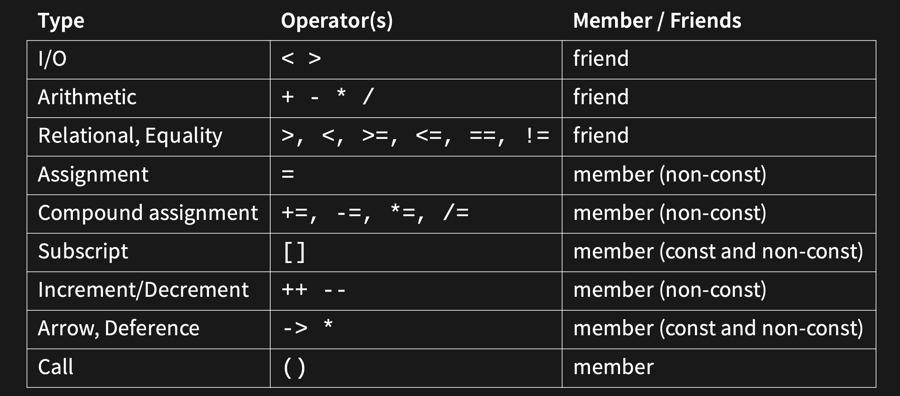

# w4lec1

Tags: lec
Status: Done
contents: operator overloads: i/o, compound assignment, relational equality, assignment, subscript, increment/decrement, arrow & dereferencing, type conversion, operator pairing

# Operator Overloading

**Why we need operator overloads?**

```cpp
#include <iostream>

class point {
public:
    point(int x, int y)
        : x_ { x }
        , y_ { y } {};
    [[nodiscard]] int x() const
    {
        return this->x_;
    }
    [[nodiscard]] int y() const
    {
        return this->y_;
    }
    static point add(point const& p1, point const& p2);

private:
    int x_;
    int y_;
};

void print(std::ostream& os, point const& p)
{
    os << "(" << p.x() << "," << p.y() << ")";
}

point point::add(point const& p1, point const& p2)
{
    return point { p1.x() + p2.x(), p1.y() + p2.y() };
}

auto main() -> int
{
    point p1 { 1, 2 };
    point p2 { 2, 3 };
    print(std::cout, point::add(p1, p2));
    std::cout << "\n";
}
```

If we want to add two points together, we should …

```cpp
print(std::cout, point::add(p1, p2));
```

But we want to simplify that to …

```cpp
// if we run this now, it will give an error,
// since they are invalid operands to a binary expression
std::cout << p1 + p2;
```

SO … ***OPERATOR OVERLOADS!!!!***

```cpp
#include <iostream>

class point {
public:
    point(int x, int y)
        : x_ { x }
        , y_ { y } {};
    friend point operator+(point const& lhs,
        point const& rhs);
    friend std::ostream& operator<<(std::ostream& os,
        point const& p);

private:
    int x_;
    int y_;
};

point operator+(point const& lhs, point const& rhs)
{
    return point(lhs.x_ + rhs.x_, lhs.y_ + rhs.y_);
}

std::ostream& operator<<(std::ostream& os, point const& p)
{
    os << "(" << p.x_ << "," << p.y_ << ")";
    return os;
}

auto main() -> int
{
    point p1 { 1, 2 };
    point p2 { 2, 3 };
    // what compiler is doing here:
    // it see p1 + p2, then it gets into the class and find the function,
    // then change that to operator+(p1, p2)
    // And for the out stream with << 
    // it changes std::cout << p1 + p2 into opearator<<(std::cout, opearator+(p1, p2)) 
    **std::cout << p1 + p2 << "\n";**
}
```

C++ supports a rich set of operator overloading

- All operator overloads must have at least one operand of its type
- Advantages:
    - Reuse existing code semantics
    - No verbosity required for simple operations
- Disadvantages:
    - Reduced context on operations
- Only create a overload if your type has a single, obvious meaning to an operator

## Operator Overload Design



I/O should be double arrows

# I/O

```cpp
#include <iostream>
#include <istream>
#include <ostream>

class point {
public:
    point(int x, int y)
        : x_ { x }
        , y_ { y } {};
    friend std::ostream& operator<<(std::ostream& os, const point& type);
    friend std::istream& operator>>(std::istream& is, point& type);

private:
    int x_;
    int y_;
};

std::ostream& operator<<(std::ostream& os, point const& p)
{
    os << "(" << p.x_ << "," << p.y_ << ")";
    return os;
}

/*std::istream& operator>>(std::istream& is, point& p) {
        // To be done in tutorials
}*/

auto main() -> int
{
    point p(1, 2);
    std::cout << p << '\n';
}
```

# Compound Assignment

- Sometimes particular methods might not have any real meaning, and they should be omitted (in this case, what does dividing two points together mean)
- Each class can have any number of `operator+=` operators, but there can only be one `operator+=(X)` where X is a type
    - That’s why in this case we have two multiplier compound assignment operators

```cpp
class point {
public:
    point(int x, int y)
        : x_ { x }
        , y_ { y } {};
    point& operator+=(point const& p);
    point operator+(point const& p);
    point& operator-=(point const& p);
    point& operator*=(point const& p);
    point& operator/=(point const& p);
    point& operator*=(int i);

private:
    int x_;
    int y_;
};

point& point::operator+=(point const& p)
{
    x_ += p.x_;
    y_ += p.y_;
    return *this;
}

point point::operator+(point const& p1, point const& p2) {
		auto p = point { p1 };
		p += p2;
		return p;
}

point& point::operator-=(point const& p) {
    x_ -= p.x_;
    y_ -= p.y_;
    return *this;
}
point& point::operator*=(point const& p) {
    x_ *= p.x_;
    y_ *= p.y_;
    return *this;
}
point& point::operator/=(point const& p) {
    x_ /= p.x_;
    y_ /= p.y_;
    return *this;    
}
point& point::operator*=(int i) {
    x_ *= i;
    y_ *= i;
    return *this;    
}
```

### Copy

```cpp
int main() {
		auto a = point { 1, 2 };
		auto b = point { 3, 4 };
		auto c = point { 5, 6 };
		
		a = c; // copy assignment

		// these 2 lines are the same
		auto q = c; // copy construction
		auto p = point{ c }; // copy construction
}
```

# Relational Equality

```cpp
#include <iostream>

class point {
public:
    point(int x, int y)
        : x_ { x }
        , y_ { y }
    {
    }
    // hidden friend - preferred
    friend bool operator==(point const& p1, point const& p2)
    {
        return p1.x_ == p2.x_ and p1.y_ == p2.y_;
        // return std::tie(p1.x_, p1.y_) == std::tie(p2.x_, p2.y_);
    }
    friend bool operator!=(point const& p1, point const& p2)
    {
		    **// we can simply define != based on our previous defintion on ==**
        **return not(p1 == p2);**
    }
    friend bool operator<(point const& p1, point const& p2)
    {
        return p1.x_ < p2.x_ and p1.y_ < p2.y_;
    }
    friend bool operator>(point const& p1, point const& p2)
    {
        **return p2 < p1;**
    }
    friend bool operator<=(point const& p1, point const& p2)
    {
        **return not(p2 < p1);**
    }
    friend bool operator>=(point const& p1, point const& p2)
    {
        **return not(p1 < p2);**
    }

private:
    int x_;
    int y_;
};

auto main() -> int
{
    auto const p2 = point { 1, 2 };
    auto const p1 = point { 1, 2 };
    std::cout << "p1 == p2 " << (p1 == p2) << '\n';
    std::cout << "p1 != p2 " << (p1 != p2) << '\n';
    std::cout << "p1 < p2 " << (p1 < p2) << '\n';
    std::cout << "p1 > p2 " << (p1 > p2) << '\n';
    std::cout << "p1 <= p2 " << (p1 <= p2) << '\n';
    std::cout << "p1 >= p2 " << (p1 >= p2) << '\n';
}
```

# Assignment

```cpp
#include <istream>

class point {
public:
    point(int x, int y)
        : x_ { x }
        , y_ { y } {};
    point& operator=(point const& p);

private:
    int x_;
    int y_;
};

point& point::operator=(point const& p)
{
    x_ = p.x_;
    y_ = p.y_;
    return *this;
}
```

# Subscript

- Usually only defined on indexable containers
- Different operators for get/set
- Asserts are the right approach here as preconditions:
    - In other containers (e.g. vector), invalid index access is undefined behaviour. Usually an explicit crash is better than undefined behaviour
    - Asserts are stripped out of optimised builds

```cpp
#include <cassert>

class point {
public:
    point(int x, int y)
        : x_ { x }
        , y_ { y } {};
        
    // we need non-const version for this, since we want to modify this sometimes
    int& operator[](int i)
    {
        assert(i == 0 or i == 1);
        return i == 0 ? x_ : y_;
    }
    // for the case the point is const
    int operator[](int i) const
    {
        assert(i == 0 or i == 1);
        return i == 0 ? x_ : y_;
    }

private:
    int x_;
    int y_;
};

int main() {
		auto a = point { 1, 3 };
		a[0] = 4;  // ref to that x_ coordinate of the point thing equals 4
		std::cout << a[0] << "\n";
}
```

# Increment/Decrement

***prefix***: ++x, --x returns lvalue reference

***postfix***: x++, x-- returns rvalue reference

- Performance: prefix > postfix
- Different operators for get/set
- Postfix operator takes in an int
    - this is not to be used
    - it is only for function matching
    - don’t name the variable

```cpp
// RoadPosition.h:
class RoadPosition {
public:
    RoadPosition(int km)
        : km_from_sydney_(km)
    {
    }
    RoadPosition& operator++(); // prefix
    // This is *always* an int, no
    // matter your type.
    RoadPosition operator++(int); // postfix
    void tick();
    int km() { return km_from_sydney_; }

private:
    void tick_();
    int km_from_sydney_;
};
```

```cpp
// RoadPosition.cpp:
#include <iostream>

// pre increment
RoadPosition& RoadPosition::operator++()
{
    this->tick_();
    return *this;
}

// post increment: we increment after we return that
// like we have increment from 5->6, but we will still return 5
RoadPosition RoadPosition::operator++(int)
{
		// create a copy of a old object for return
    RoadPosition rp = *this;
    // do the increment
    this->tick_();
    return rp;
}

void RoadPosition::tick_()
{
    ++(this->km_from_sydney_);
}

auto main() -> int
{
    auto rp = RoadPosition(5);
    std::cout << rp.km() << '\n';
    auto val1 = (rp++).km(); // 5
    auto val2 = (++rp).km(); // 7
    std::cout << val1 << '\n';
    std::cout << val2 << '\n';
}
```

```cpp
auto main() -> int
{
    auto rp = RoadPosition(5);
    std::cout << rp.km() << '\n';
    auto val1 = (rp++).km(); // 5
    auto val2 = (rp++).km(); // 6
    std::cout << val1 << '\n';
    std::cout << val2 << '\n';
}
```

```cpp
auto main() -> int
{
    auto rp = RoadPosition(5);
    std::cout << rp.km() << '\n';
    auto val1 = (++rp).km(); // 6
    auto val2 = (++rp).km(); // 7
    std::cout << val1 << '\n';
    std::cout << val2 << '\n';
}
```

# Arrow & Dereferencing

```cpp
#include <iostream>
class stringptr {
public:
    explicit stringptr(std::string const& s)
        : ptr_ { new std::string(s) }
    {
    }
    ~stringptr()
    {
        delete ptr_;
    }
    std::string* operator->() const
    {
        return ptr_;
    }
    std::string& operator*() const
    {
        return *ptr_;
    }

private:
    std::string* ptr_;
};

auto main() -> int
{
    auto p = stringptr("smart pointer");
    std::cout << *p << '\n';
    std::cout << p->size() << '\n';
}
```

# Type Conversion

```cpp
#include <iostream>
#include <vector>

class point {
public:
    point(int x, int y)
        : x_(x)
        , y_(y)
    {
    }
    // convert a point to a vector
    explicit operator std::vector<int>()
    {
        std::vector<int> vec;
        vec.push_back(x_);
        vec.push_back(y_);
        return vec;
    }

private:
    int x_;
    int y_;
};

int main()
{
    auto p = point(1, 2);
    auto vec = static_cast<std::vector<int>>(p);
    std::cout << vec[0] << '\n';
    std::cout << vec[1] << '\n';
}
```

# Operator Pairing

If you define something, you should also define something else.

