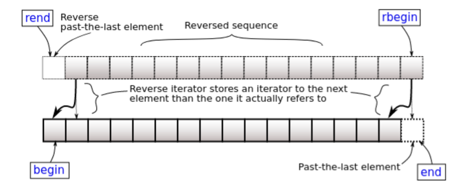

# w4lec2

Tags: lec
Status: Done
contents: iterator revision; iterator invalidation; custom iterators: iterator traits, iterator requirements, container requirements, bidirectional iterators; iterator types: automatic reverse iterators, random access iterators

# Iterator Revision

Iterator is an abstract notion of a pointer

Iterators are types that abstract container data as a sequence of objects

The glue between containers and algorithms

- Designers of algorithms don’t care about details about data structure
- Designers of data structure don’t have to provide extensive access operations

```cpp
std::vector v{1, 2, 3, 4, 5};
++(*v.begin()); // vector<int>'s non-const iterator
*v.begin(); // vector<int>'s const iterator
v.cbegin(); // vector<int>'s const iterator
```

# Iterator Invalidation

In general:

- Containers generally don't invalidate when you modify values
- But they may invalidate when removing or adding elements
- std::vector invalidates everything when adding elements
- std::unordered_(map/set) invalidates everything when adding elements

```cpp
#include <vector>

int main()
{
    std::vector v { 1, 2, 3, 4, 5 };
    // Copy all 2s
    for (auto it = v.begin(); it != v.end(); ++it) {
        if (*it == 2) {
            v.push_back(2);
        }
    }
}
```

```cpp
#include <vector>

int main()
{
    std::vector v { 1, 2, 3, 4, 5 };
    // Erase all even numbers (C++11 and later)
    for (auto it = v.begin(); it != v.end();) {
        if (*it % 2 == 0) {
            it = v.erase(it);
        } else {
            ++it;
        }
    }
}
```

# Custom Iterators

## Iterator Traits

Each iterator has certain properties

- Category: input, output, forward, bidirectional, random-access
- Value type (T)
- Reference type (T& and const T&)
- Pointer type (T* and T* const)
    - not strictly required
- Difference type: type used to count how far it is between iterators

When writing your own iterators, you need to tell the compiler what each of these are

## Iterator Requirements

A custom iterator class should look, at minimum, like this

```cpp
class Iterator {
public:
		// those lines are something like a template for custom iterator
    using iterator_category = std::forward_iterator_tag;
    // replace T with the type we want
    using value_type = T;
    using referenece = T&;
    using pointer = T*;  // not strictly required, but nice to have
    // it's a counter for how many steps we jump
    using difference_type = int;

    referenece operator*() const;
    Iterator operator++();
    Iterator operator++(int)
    {
        auto copy { *this };
        ++(*this);
        return copy;
    }
    // this one isn't strictly required, but nice to have
    pointer operator->() const { return &(operator*()); }

    friend bool operator==(const Iterator& lhs, const Iterator& rhs) { ... };
    friend bool operator!=(const Iterator& lhs, const Iterator& rhs) { return !(lhs == rhs); };
}
```

## Container Requirements

- All a container needs to do is to allow `std::[cr]begin`/`std::[cr]end`
    - This allows use in range-for loops and std algorithms
- Easiest Way is to define `begin`/`end`/`cbegin`/`cend` methods
- By convention, we also define a type `Container::[const_]iterator`

```cpp
// Define a forward iterator

// Here we are using vector, 
// but this can be changed into any conatiner we want
class vector {
    class Iterator {
		public:
				// those lines are something like a template for custom iterator
		    using iterator_category = std::forward_iterator_tag;
		    // replace T with the type we want
		    using value_type = T;
		    using referenece = T&;
		    using pointer = T*;  // not strictly required, but nice to have
		    using difference_type = int;
		
		    referenece operator*() const;
		    Iterator operator++();
		    Iterator operator++(int)
		    {
		        auto copy { *this };
		        ++(*this);
		        return copy;
		    }
		    // this one isn't strictly required, but nice to have
		    pointer operator->() const { return &(operator*()); }
		
		    friend bool operator==(const Iterator& lhs, const Iterator& rhs) { ... };
		    friend bool operator!=(const Iterator& lhs, const Iterator& rhs) { return !(lhs == rhs); };
		}
    using iterator = Iterator;
    using const_iterator = Iterator;

    // need to define these
    iterator begin();
    iterator end();

    // if you want const iterators, define these
    const_iterator begin() const { return cbegin(); }
    const_iterator cbegin() const;
    const_iterator end() const { return cend(); }
    const_iterator cend() const;
}
```

## Bidirectional Iterators

**Need to define `operator--()` on your iterator**

- need to move from `c.end()` to the last element
- `c.end()` cannot be `nullptr`

Need to define the following on your container:

```cpp
class Container {
    // make the iterator using one of these by convention
    class reverse_iterator {
		    using iterator_category = std::bidirectional_iterator_tag;
        ...
    };
    // or
    using reverse_iterator = ...;

    // need to define these
    reverse_iterator rbegin();
    reverse_iterator rend();

    // if you want const reverse_iterators, define these
    const_reverse_iterator rbegin() const { return crbegin(); }
    const_reverse_iterator crbegin() const;
    const_reverse_iterator rend() const { return crend(); }
    const_reverse_iterator crend() const;
}
```

# Iterator Types

## Automatic Reverse Iterators

**Reverse iterators can be created by `std::reverse_iterator`**

- Requires a bidirectional iterator

Just copy-and-paste the following code:

```cpp
class Container {
    // make the iterator using these
    using reverse_iterator = std::reverse_iterator<iterator>;
    using const_reverse_iterator = std::reverse_iterator<const_iterator>;

    // need to define these
    reverse_iterator rbegin() { return reverse_iterator { begin() }; };
    reverse_iterator rend() { return reverse_iterator { end() }; };

    // if you want const reverse_iterators, define these
    const_reverse_iterator rbegin() const { return crbegin(); }
    const_reverse_iterator crbegin() const { return const_reverse_iterator { cend() }; };
    const_reverse_iterator rend() const { return crend(); }
    const_reverse_iterator crend() const { return const_reverse_iterator { cbegin() }; };
}
```

Reverse iterators can be created by `std::reverse_iterator` 

- `rbegin()` store `end()`, so `*rbegin` is actually `*(--end())`



## Random Access Iterators

```cpp
class Iterator {
    ... using reference = T&;
    using difference_type = int;

    Iterator& operator+=(difference_type rhs) {... } Iterator& operator-=(difference_type rhs) { return *this += (-rhs); }
    reference operator[](difference_type index) { return *(*this + index); }

    friend Iterator operator+(const Iterator& lhs, difference_type rhs)
    {
        Iterator copy { *this };
        return copy += rhs;
    }
    friend Iterator operator+(difference_type lhs, const Iterator& rhs) { return rhs + lhs; }
    friend Iterator operator-(const Iterator& lhs, difference_type rhs) { return lhs + (-rhs); }
    friend difference_type operator-(const Iterator& lhs, const Iterator& rhs) { ... }

    friend bool operator<(Iterator lhs, Iterator rhs) { return rhs - lhs > 0; }
    friend bool operator>(Iterator lhs, Iterator rhs) { return rhs - lhs < 0; }
    friend bool operator<=(Iterator lhs, Iterator rhs) { !(lhs > rhs); }
    friend bool operator>=(Iterator lhs, Iterator rhs) { !(lhs < rhs); }
}
```

*Why we need multiple + here?*

```cpp
auto it = v.begin();
it += 5; // ITERATOR + NUMBER
auto i2 = v.begin() + it; // ITERATOR + ITERATOR
```