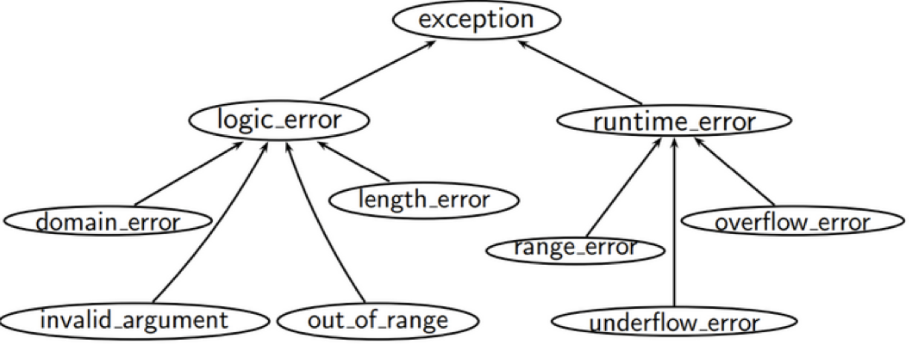

# w5lec1

Tags: lec
Status: Done
contents: exceptions: exception objects, conceptual structure, multi catch options, re-throw; catch the right way; exception safety levels; exception and catch2

# Exceptions

```cpp
#include <iostream>
#include <vector>

auto main() -> int
{
    std::cout << "Enter -1 to quit\n";
    std::vector<int> items { 97, 84, 72, 65 };
    std::cout << "Enter an index: ";
    for (int print_index; std::cin >> print_index;) {
        if (print_index == -1)
            break;
            
        **// when using .at method,** 
        // it will check if the int passed is out of bound, 
        // if it is, it will crash and throw an error
        std::cout << items.at(static_cast<unsigned int>(print_index)) << '\n';
        
        **// when using subscript,** 
        // it will not throw an error 
        // even if the int given is out of bound like 4, 5, ..., 10000, ... 
        // it will that read that memory
        std::cout << items.[static_cast<unsigned int>(print_index)] << '\n';
        
        std::cout << "Enter an index: ";
    }
}
```

```cpp
#include <iostream>
#include <vector>

auto main() -> int
{
    std::cout << "Enter -1 to quit\n";
    std::vector<int> items { 97, 84, 72, 65 };
    std::cout << "Enter an index: ";
    for (int print_index; std::cin >> print_index;) {
        if (print_index == -1)
            break;
        try {
            std::cout << items.at(static_cast<unsigned int>(print_index)) << '\n';
            items.resize(items.size() + 10);
        } catch (const std::out_of_range& e) {
            std::cout << "Index out of bounds\n";
        } catch (...) {
            std::cout << "Something else happened";
        }
        std::cout << "Enter an index: ";
    }
}
```

## What & Why

### What

***Exceptions***: Are for exceptional circumstances

- Happen during run-time anomalies (things not going to plan A)

***Exception handling***:

- Run-time mechanism
- C++ detects a run-time error and raises an appropriate exception
- Another unrelated part of code catches the exception, handles it, and potentially re-throw it

### Why

Allows us to gracefully and programmatically deal with anomalies, as opposed to our program crashing

## Exception Objects

Any type we derive from `std::exception` 

- throw `std::out_of_range(”Exception!”);`
- throw `std::bad_alloc(”Exception!”);`

**Why `std::exception`? Why classes?**

- `#include <exception>` for `std::exception` object
- `#include <stdexcept>` for object that inherit `std::exception`

[https://stackoverflow.com/questions/25163105/stdexcept-vs-exception-headers-in-c](https://stackoverflow.com/questions/25163105/stdexcept-vs-exception-headers-in-c)

[https://en.cppreference.com/w/cpp/error/exception](https://en.cppreference.com/w/cpp/error/exception)



Since sometimes we want to catch all logic_errors instead only single out_of_range errors, or we want to catch all exception errors, we need the inheritance here

## Conceptual Structure

Exceptions are treated like ***lvalues***

Limited type conversions exist (pay attention to them):

- non-const to const
- other conversion we will not cover here

```cpp
try {
		// Code that may throw an exception
} **catch (/* exception type */) {**
		// Do something with the exception
} **catch (...) { // all other exceptions**
		// Do something with the exception
}
```

```cpp
try {
    std::cout << items.at(static_cast<unsigned int>(print_index)) << '\n';
    items.resize(items.size() + 10);
} catch (const std::out_of_range& e) {
    std::cout << "Index out of bounds\n";
} catch (...) {
    std::cout << "Something else happened";
}
```

**Difference between `catch(const std::exceptions& e)` and `catch(…)`**

- Theoretically, `catch(const std::exceptions& e)` will catch all the exceptions, but we are not sure if people write the exception is inheritance of `std::exceptions`
- We handle all the stuff making the program crash

## Multiple Catch Options

This does not mean multiple catches will happen, but rather that multiple options are possible for a single catch

```cpp
#include <iostream>
#include <vector>

auto main() -> int
{
    auto items = std::vector<int> {};
    try {
        items.resize(items.max_size() + 1);
    } catch (std::bad_alloc& e) {
        std::cout << "Out of bounds.\n";
    } catch (std::exception&) {
        std::cout << "General exception.\n";
    }
}
```

## Re-Throw

When an exception is caught, by default the catch will be the only part of the code to use/action the exception

What if other catches (lower in the precedence order) want to do something with the thrown exception?

```cpp
try {
		try {
				try {
						throw T{};
				} catch (T& e1) {
						std::cout << "Caught\n";
						throw;
				}
		} catch (T& e2) {
				std::cout << "Caught too!\n";
				throw;
		}
} catch (...) {
std::cout << "Caught too!!\n";
}
```

# Catch The Right Way

**Throw by value, catch by const reference!!!**

- anything can be thrown in C++, even `throw int{1};` will work in C++

Ways to catch exceptions:

- By value (NO!)
- By pointer (NO!)
- ***By reference (YES!!)***

References are preferred because:

- more efficient, less copying
- no slicing problem (related to polymorphism)

**Object slicing problem**

```cpp
class Animal {
	protected:
	std::string name_;
	int num_legs_;
}

class Dog : Animal {
	private:
	std::string breed_;
}

// Animal = name, num_legs
// Dog = name, num_legs, breed <<< THIS HAS MORE MEMPRY

Animal a = Animal{};
Dog d = Dog{};

Animal a2 = Dog{}; // WHAT HAPPEN HERE?
// it will slice the part that relevant to a Dog,
// and just keep the part a Animal has
// -> OBJECT SLICING
```

```cpp
Animal& a2 = Dog{}; // THIS WILL BE FINE
// no slicing happens here, 
// since a2 is just a pointer to the dog
```

**Catch By Value**

```cpp
#include <iostream>

class Giraffe {
public:
    Giraffe() { std::cout << "Giraffe constructed" << '\n'; }
    Giraffe(const Giraffe& g) { (void) g; std::cout << "Giraffe copy-constructed" << '\n'; }
    ~Giraffe() { std::cout << "Giraffe destructed" << '\n'; }
};

void zebra()
{
    throw Giraffe {};
}

void llama()
{
    try {
        zebra();
    } **catch (Giraffe g)** {
        (void) g;
        std::cout << "caught in llama; rethrow" << '\n';
        // re-throw
        throw;
    }
    // The copied Giraffe destructed here,
    // since it gets out of the scope
}

int main()
{
    try {
        llama();
    } **catch (Giraffe g)** {
        (void) g;
        std::cout << "caught in main" << '\n';
    }
}
```

**Catch By Reference**

```cpp
#include <iostream>

class Giraffe {
public:
    Giraffe() { std::cout << "Giraffe constructed" << '\n'; }
    Giraffe(const Giraffe& g) { (void) g; std::cout << "Giraffe copy-constructed" << '\n'; }
    ~Giraffe() { std::cout << "Giraffe destructed" << '\n'; }
};

void zebra()
{
    throw Giraffe {};
}

void llama()
{
    try {
        zebra();
    } **catch (const Giraffe& g**) {
        (void) g;
        std::cout << "caught in llama; rethrow" << '\n';
        throw;
    }
}

int main()
{
    try {
        llama();
    } **catch (const Giraffe& g)** {
        (void) g;
        std::cout << "caught in main" << '\n';
    }
}
```

# Exception Safety Levels

Every function has a level a exception safety

Operations performed have various levels of safety

- No-throw: failure transparency
- Strong exception safety: commit-or-rollback
- Weak exception safety: no-leak
- No exception safety

## No-Throw Guarantee

- Also known as ***failure transparency***
- Operations are guaranteed to succeed, even in exceptional circumstances
    - Exceptions may occur, but are ***handled internally***
    - ***No exceptions are visible to the client***
- This is the same, for all intents and purposes, as noexcept in C++

Examples:

- Closing a file
- Freeing memory
- Anything done in constructors or moves (usually)
- Creating a trivial object on the stack (made up of only ints)

### noexcept specifier

- Specifies whether a function could potentially throw
- ***It does not actually prevent a function from throwing an exception.***
- STL functions can operate more efficiently on noexcept functions

```cpp
class S {
public:
	int foo() const; // may throw
}

class S {
public:
	int foo() const **noexcept**; // does not throw
} 
```

## Strong Exception Safety

- Also known as “***commit or rollback***” semantics
- Operations can fall, but failed operations are guaranteed to have no visible effects
- Probably the most common level of exception safety in C++
- All your copy-constructor should generally follow these semantics
- Similar for copy-assignment
    - Copy-and-swap idiom (usually) follows these semantics (why?)
    - Can be difficult when manually writing copy-assignment

***To achieve strong exception safety, you need to:***

- First perform any operations that may throw, but don’t do anything irreversible
- Then perform any operations that are irreversible, but don’t throw


## Basic/Weak Exception Safety

- This is known as the ***no-leak guarantee***
- Partial execution of failed operations can cause side effects, but:
    - All invariants must be preserved
    - No resources are leaked
- Any stored data will contain valid values, even if it was different now from before the exception
    - Familiar to a “valid, but unspecified state”
    - Move constructors that are not noexcept follow these semantics

## No Exception Safety

- No guarantees
- DO NOT write C++ with no exception safety
    - Very hard to debug when things go wrong
    - Very easy to fix-wrap your resources and attach lifetimes, which gives you basic exception safety for free

# Exception And Catch2

