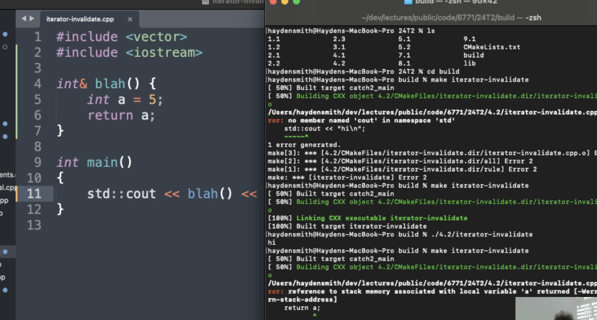

# w5lec2

Tags: lec
Status: Done
contents: resource management: objects, long lifetime, new/delete, rule of 5, copy/move, lvalue/rvalue, (explicitly/implicitly) deleted copy/move, RAII, object lifetime

# Objects

***What is an object in C++?***

- An object is a region of memory associated with a type
- Unlike some other languages (Java), basic types such as int and bool are objects

**For the most part, C++ objects are designed to be intuitive to use.**

***What special things can we do with objects:***

- Create
- Destroy
- Copy
- Move

# Long Lifetimes

There are 3 ways you can try and make an object in C++ have a lifetime that ***outlives the scope it was defined it***:

- Returning it out of a function via copy (can have limitations)

```cpp
int number() {
	int a = 5;
	return a;
}
```

- Returning it out of a function via references (bad, see slide below)

```cpp
int& number() {
	int a = 5;
	return a;
}
```



it will just throw a warning, error is thrown here since we add -Werror flag when compiling

- Returning it out of a function as a heap resources (today’s lecture)

```cpp
int* number() {
	int* a = malloc(sizeof(int));
	return a;
}
```

### References - have a problem

- We need to be careful when returning references.
- The object must always outlive the reference.
- This is undefined behaviour - if you are unlucky, the code might even work!
- Moral of the story: Do not return references to variables local to the function returning.
- For objects we create INSIDE a function, we are going to have to create heap memory and return that.

```cpp
// these are okay since we are passing in a ref
// and return that same ref
auto okay(int &i) -> int& {
	return i;
}

auto okay(int& i) -> int const& {
	return i;
}
```

```cpp
auto not_okay(int i) -> int& {
	return i;
}

auto not_okay() -> int& {
	auto i = 0;
	return i;
}
```

It is not saying we can’t return references to stack items, instead it’s to say that ***we can’t return references to stack items where the reference is going to outlive the lifetime of the underlying object***.

# New / Delete

Objects are ***either stored on the stack or the heap***.

In general, ***most times*** you’ve been creating objects of a type it has been ***on the stack***.

We can ***create heap objects*** via **new** and free them via **delete** just like C (malloc/free)

- New and delete call the constructors/destructors of what they are creating

```cpp
#include <iostream>
#include <vector>

int main() {
	int* a = new int{4};
	std::vector<int>* b = new std::vector<int>{1, 2, 3};
	std::cout << *a << "\n";
	std::cout << (*b)[0] << "\n";
	delete a;
	delete b;
	return 0;
}
```

***Why do we need heap resources?***

- Heap object outlives the scope it was created in
- More useful in contexts where we need more explicit control of ongoing memory size (e.g. vector as a dynamically sized array)
- Stack has limited space on it for storage, heap is much larger

```cpp
#include <iostream>
#include <vector>

int* newInt(int i) {
	int* a = new int{i};
	return a;
}

int main() {
	int* myInt = newInt(5);
	std::cout << *myInt << "\n";  // a was defined in a scope that no longer exists
	delete myInt;
	return 0;
}
```

## std::vector<int> under the hood

```cpp
int main() {
	int* data = new int[10];
	delete[] data;
	
	int i = new int;
	delete i;
}
```

```cpp
class my_vec {
	// constructor
	my_vec(int size): data_{new int[size]}, size_{size}, capacity_{size} {}
	
	// destructor
	~my_vec() {};
	
	int* data_;
	int size_;
	int capacity_;
}
```

## Destructors

Called when the object goes out of scope

- What might this be handy for?
- Does not occur for reference objects

Implicitly noexcept

- What would the consequences be if this were not the case

Why might destructors be handy?

- Freeing pointers
- Closing files
- Unlocking mutex (from multithreading)
- Aborting database transactions

What happens when `my_vec` goes out of scope?

- Destructors are called on each member
- Destructing a pointer type does nothing

```cpp
class my_vec {
	// constructor
	my_vec(int size): data_{new int[size]}, size_{size}, capacity_{size} {}
	
	// destructor
	~my_vec() {};
	
	int* data_;
	int size_;
	int capacity_;
}
```

Right now this results in a memory leak. How do we fix it?

```cpp
my_vec::~my_vec() {
	delete[] data_;
}
```

# Rule of 5

When writing a class, if we can’t default all of our operators (preferred), we should consider the “rule of 5”

- Destructor
- Copy constructor
- Copy assignment
- Move assignment
- Move constructor

The presence or absence of these 5 operations are critical in managing resources.

## Vector - Overall

Though you should always consider it, you should rarely have to write it

- If all data members have one of these defined, then the class should automatically define this for you
- But this may not always be what you want
- C++ follows the principle of “only pay for what you use”
    - Zeroing out the data for an int is extra work
    - Hence, moving an int actually just copies it
    - Same for other basic types

```cpp
class my_vec {
	// constructor
	my_vec(int size): data_{new int[size]}, size_{size}, capacity_{size} {}
	
	// copy constructor
	my_vec(my_vec const&) = default;
	// copy assignment
	my_vec& operator=(my_vec const&) = default;
	
	// move constructor
	my_vec(my_vec&&) noexcept = default;
	// move assignment
	my_vec& operator=(my_vec&&) noexcept = default;
	
	// destructor
	~my_vec() {};
	
	int* data_;
	int size_;
	int capacity_;
}
```

```cpp
// call constructor
auto vec_short = my_vec(2);
auto vec_long = my_vec(9);

// doesn't do anything, just create a reference for a vector
auto& vec_ref = vec_long;

// calls copy constructor
// if something does not exist, it should be constructed first
auto vec_short2 = vec_short;
// calls copy assignment
// before being assigned, it needs to exist, i.e. having been constructed
vec_short2 = vec_long;

// calls move constructor
// vec_long will become rubbish after the move
auto vec_long2 = std::move(vec_long);
// calls move assignment
vec_long2 = std::move(vec_short);
```

```cpp
// copy constructor
auto s = std::vector<int>{1, 2, 3};
std::vector<int> p = s;
auto q = std::vector<int>{s};
```

```cpp
// copy assignment
std::vector<int> p{};  // fully created by default constructor
p = s;  // copy assignment
```

how copy work:


the original data is still safely kept there

how move work:


the original data have been moved to the new object, and the old one is still there but nothing inside

# Copy

## Vector - Copy Constructor

What does it mean to copy a `my_vec`?

What does the default synthesised copy constructor do?

- It does a member-wise copy

What are the consequences?

- Any modification to `vec_short` will also change `vec_short2`
- We will perform a double free

How can we fix this?

```cpp
class my_vec {
	// constructor
	my_vec(int size): data_{new int[size]}, size_{size}, capacity_{size} {}
	
	// copy constructor
	my_vec(my_vec const&) = default;
	// copy assignment
	my_vec& operator=(my_vec const&) = default;
	
	// move constructor
	my_vec(my_vec&&) noexcept = default;
	// move assignment
	my_vec& operator=(my_vec&&) noexcept = default;
	
	
	// destructor
	~my_vec() {};
	
	int* data_;
	int size_;
	int capacity_;
}

my_vec::my_vec(my_vec const& orig): data_{new int[orig.size_]},
																		size_{orig.size_},
																		capacity_{orig.size_} {
	std::copy(orig.data_, orig.data_ + orig.size_, data_);
}

auto vec_short = my_vec(2);
auto vec_short2 = vec_short;
```

## Vector - Copy Assignment

Assignment is the same as construction, except that there is already a constructed object in your destination.

- You need to clean up the destination first
- The copy-and-swap idiom makes this trivial

```cpp
my_vec& my_vec::operator=(my_vec const& orig) {
	my_vec(orig).swap(*this);
	return *this;
}

void my_vec::swap(my_vec& other) {
	std::swap(data_, other.data_);
	std::swap(size_, other.size_);
	std::swap(capacity_, other.capacity_);
}

// Alternation implementation, may not be performant
my_vec& my_vec::operator=(my_vec const& orig) {
	my_vec copy = orig;
	std::swap(copy, *this);
	return *this;
}
```

```cpp
auto vec_short = my_vec(2);
auto vec_long = my_vec(9);
vec_long = vec_short;
```

# Lvalue VS Rvalue

***lvalue***: An expression that is an object reference

- e.g. variable name, subscript reference
- Always has a defined address in memory

***rvalue***: Expression that is not an lvalue

- e.g. object literals, return results of a function
- Generally has no storage associated with it

```cpp
int main() {
	int i = 5;  // 5 is rvalue, i is lvalue
	int j = i; // j is lvalue, i is lvalue
	int k = 4 + i; // 4 + i produces rvalue, then stored in lvalue k
}
```

```cpp
auto a = std::vector<int>{1, 2, 3};
auto b = std::vector<int>{a};

// std::vector<int>& -- lvalue reference "reference"
// std::vector<int>&& -- rvalue reference
```

## Lvalue References

```cpp
void f(my_vec& x);
```

There are multiple types of references

- Lvalue references look like `T&`
- Lvalue references to const look like `T const&`

Once the lvalue reference goes out of scope, it may still needed.

## Rvalue References

```cpp
void f(my_vec&& x);
```

Rvalue references look like `T&&` .

An rvalue reference formal parameter means that the value was disposable from the caller of the function

- If outer modified value, who would notice / care?
    - The caller (main) has promised that it won’t be used anymore.
- If inner modified value, who would notice / care?
    - The caller (outer) has never made such a promise.
    - An rvalue reference parameter is an lvalue inside the function

```cpp
void inner(std::string&& value) {
	value[0] = 'H';
	std::cout << value << '\n';
}

void outer(std::string&& value) {
	inner(value); // This fails? WHY?
	std::cout << value << '\n';
}

int main() {
	outer("hello"); // This works fine.
	auto s = std::string("hello");
	inner(s); // This fails because s is an lvalue
}
```

# Move

## std::move

```cpp
// looks something like this
T&& move(T& value) {
	return static_cast<T&&>(value);
}
```

A library function that ***converts an lvalue to an rvalue*** so that a “move constructor” (similar to copy constructor) can use it.

- This says “I don’t care about this anymore”
- All this does is allow the compiler to use rvalue reference overloads

***What it does is just TYPE CASTING!!!***

- no actual movement done here
    - it does work for vector only relied on the implementation inside the std::vector library
- lvalue → rvalue

```cpp
std::move(value);
// which only means the following so far
static_cast<RVALUE REFERENCE>(value);
```

```cpp
void inner(std::string&& value) {
	value[0] = 'H';
	std::cout << value << '\n';
}

void outer(std::string&& value) {
	inner(std::move(value));
	// Value is now in a valid but unspecified state.
	// Although this isn't a compiler error, this is bad code.
	// Don't access variables that were moved from, except to reconstruct them
	std::cout << value << '\n';
}

int main() {
	outer("hello"); // this works fine
	auto s = std::string("hello");
	inner(s); // this fails because i is an lvalue
}
```

## Moving Objects

Always declare your moves as noexcept

- Failing to do so can make your code slower
- Consider: push_back in a vector

Unless otherwise specified, objects that have been moved from are in a valid but unspecified state.

Moving is an optimisation on copying.

- The only difference is that when moving, the moved-from object is mutable
- Not all types can take advantage of this
    - If moving an int, mutating the moved-from int is extra work
    - If moving a vector, mutating the moved-from vector potentially saves a lot of work

Moved from objects must be placed in a valid state

- Moved-from containers usually contain the default-constructed value
- Moved-from types that are cheap to copy are usually unmodified
- Although this is the only requirement, individual types may add their own constraints

Compiler-generated move constructor / assignment performs member-wise moves.

## Vector - Move Constructor

Very similar to copy constructor, except we can use `std::exchange` instead.

```cpp
class my_vec {
	// constructor
	my_vec(int size): data_{new int[size]}, size_{size}, capacity_{size} {}
	
	// copy constructor
	my_vec(my_vec const&) = default;
	// copy assignment
	my_vec& operator=(my_vec const&) = default;
	
	// move constructor
	my_vec(my_vec&&) noexcept = default;
	// move assignment
	my_vec& operator=(my_vec&&) noexcept = default;
	
	
	// destructor
	~my_vec() {};
	
	int* data_;
	int size_;
	int capacity_;
}

my_vec::my_vec(my_vec&& orig) noexcept
: data_{std::exchange(orig.data_, nullptr)}
, size_{std::exchange(orig.size_, 0)}
, capacity_{std::exchange(orig.capacity_, 0)} {}

auto vec_short = my_vec(2);
auto vec_short2 = std::move(vec_short);
```

```cpp
// neater way
my_vec::my_vec(my_vec&& orig) noexcept
: data_{std::exchange(orig.data_, nullptr)}
, size_{std::exchange(orig.size_, 0)}
, capacity_{std::exchange(orig.capacity_, 0)} {}

// which does the same thing as
my_vec::my_vec(my_vec&& orig) noexcept {
	data_ = std::move(orig.data_);
	size_ = std::move(orig.size_);
	capacity_ = std::move(orig.capacity_);
	orig.data_ = nullptr;
	orig.size_ = 0;
	orig.capacity_ = 0;
}

// OR we can do this with std::swap
my_vec::my_vec(my_vec&& orig) noexcept {
	// set up the new data
	this->data_ = nullptr;
	this->size_ = 0;
	this->capacity_ = 0;
	// swap with the old state
	std::swap(this->data_, orig.data_);
	std::swap(this->size_, orig.size_);
	std::swap(this->capacity_, orig.capacity_);
}
```

## Vector - Move Assignment

Like the move constructor, but the destination is already constructed.

```cpp
my_vec& my_vec::operator=(my_vec&& orig) noexcept {
	// The easiest way to write a move assignment is generally to do memberwise swaps,
	// then clean up the orig object.
	// Doing so may mean some redundant code, 
	// but it means you don't need to deal with mixed state between objects
	std::swap(data_, orig.data_);
	std::swap(size_, orig.size_);
	std::swap(capacity_, orig.capacity_);
	
	// The following line may or may not be necessary,
	// depending on if you decide to add additional constraints to your moved-from object.
	delete[] orig.data_;
	orig.data_ = nullptr;
	orig.size_ = 0;
	orig.capacity_ = 0;
	
	return *this;
}

auto vec_short = my_vec(2);
auto vec_long = my_vec(9);
vec_long = std::move(vec_short);
```

why not use the default move?

```cpp
my_vec& my_vec::operator=(my_vec&& orig) = default;

// which means
my_vec& my_vec::operator=(my_vec&& orig) {
	data_ = std::move(orig.data_);
	size_ = std::move(orig.size_);
	capacity_ = std::move(orig.capacity_);
}
```

# Deleted Copy/Move

## Explicitly

We may not want a type to be copyable / moveable

- If so, we can declare `fn() = delete`

```cpp
class T {
	T(const T&) = delete;
	T(T&&) = delete;
	T& operator=(const T&) = delete;
	T& operator=(T&&) = delete;
}
```

## Implicitly

Under certain conditions, the compiler will not generate copies and moves.

The implicitly defined copy constructor calls the copy constructor member-wise

- If one of its members doesn’t have a copy constructor, the compiler can’t generate one for you
- Same applies for copy assignment, move constructor and move assignment

Under certain conditions, the compiler will not automatically generate copy / move assignment / constructors

- e.g. If you have manually defined a destructor, the copy constructor isn’t generated

***If you define one of the rule of five, you should explicitly delete, default, or define all five***

- If the default behaviour isn’t sufficient for one of them, it likely isn’t sufficient for others
- Explicitly doing this tells the reader of your code that you have carefully considered this
- This also means you don’t need to remember all of the rules about “if I write X, then is Y generated”