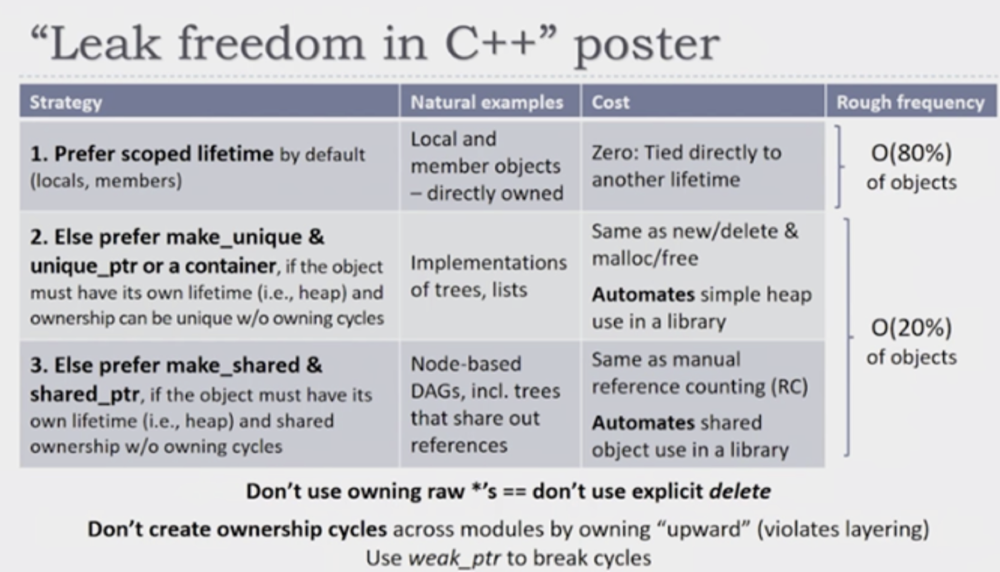

# w7lec1

Tags: lec
Status: Done
contents: object lifetimes; RAII; smart pointers: unique pointer, shared pointer, when to use which, leak freedom; stack unwinding

**WHY?**

Managing unnamed / heap memory can be dangerous, as there is always the chance that the resource is not released / free’d properly.

# Object Lifetimes

To create safe object lifetimes in C++, we always attach the lifetime of one object to that of something else

***Named objects***

- A variable in a function is tied to its scope
- A data member is tied to the lifetime of the class instance
- An element in a std::vector is tied to the lifetime of the vector

***Unnamed objects***

- A heap object should be tied to the lifetime of whatever object created it
- Examples of bad programming practice
    - An owning raw pointer is tied to nothing
    - A C-style array is tied to nothing

# RAII

***RAII = Resource Acquisition Is Initialisation***

- Resource = heap object
- A concept where we encapsulate resources inside objects
    - Acquire the resource in the constructor
    - Release the resource in the destructor
    - e.g. memory, locks, files
- Every resource should be owned by either:
    - Another resource (e.g. smart pointer, data member)
    - Named resource on the stack
    - A nameless temporary variable

# Smart Pointer

## Making a pointer safe

We could write a class to make a pointer safe

```cpp
class MyIntPointer {
	public:
		// This is the constructor
		MyIntPointer(int* value): value_{value} {}
		
		// This is the destructor
		~MyIntPointer() {
			// similar to c's free function
			delete value_;
		}
		
		int* GetValue() {
			return value_;
		}
		
	private:
		int* value_;
};

void fn() {
	// similar to c's malloc
	MyIntPointer p{new int{5}};
	// copy the pointer
	MyIntPointer q{p.GetValue()};
	// p and q are both new destructed
	// what happens?
}
```

## Smart Pointers

Smart pointers are ways of wrapping unnamed (i.e. raw pointer) heap objects in named stack object to that object lifetimes can be managed much more safely.

Usually two ways of solving problems:

- unique_ptr + raw pointers
- shared_ptr + weak_ptr

| **Type** | **Shared Ownership** | **Take Ownership** |
| --- | --- | --- |
| std::unique_ptr<T> | No | Yes |
| raw pointers | No | No |
| std::shared_ptr<T> | Yes | Yes |
| std::weak_ptr<T> | No | No |

## Unique Pointer

```cpp
#include <memory>
#include <iostream>

void doo() {
	auto up1 = std::unique_ptr<int>{new int{4}}; // no memory leak, the memory of the int will be freed when out of scope
	int* u = new int{4}; // memory leak, since we have not freed the memory used in the heap
	(void)up1;
	(void)u;
}

int main() {
	while (true) {
		doo();
	}
}
```

The unique pointer ***DOES NOT have copy constructor and copy assignment***.

- For a unique pointer it’s job is to points to a heap object, and when it goes out of scope, it needs to free the memory it’s pointing to.
- If there is a copy constructor / assignment, there are two pointer points to the same memory. And when one of those is going out of scope, it will free the memory. Then the other pointer pointing to the same memory will start to point to somewhere has been freed. And there will be chaos when it wants to free that memory when it get out of scope.
- ***WE DELETE THOSE METHODS SINCE THEY DON’T MAKE SENSE HERE.***

```cpp
#include <memory>
#include <iostream>

int main() {
	auto up1 = std::unique_ptr<int>{new int};
	// auto up2 = up1; // no copy constructor
	std::unqiue_ptr<int> up3;
	// up3 = up1; // no copy assignment
}
```

### Methods

https://en.cppreference.com/w/cpp/memory/unique_ptr

***Release*:** returns a pointer to the managed object and releases the ownership

***Reset*:** replaces the managed object

***Get*:** returns a pointer to the managed object

***Operator* / Operator→*:** dereferences pointer to the managed object

```cpp
#include <memory>
#include <iostream>

int main() {
	auto up1 = std::unique_ptr<int>{new int};
	std::unqiue_ptr<int> up3;
	
	up3.reset(up1.release()); // to transfer from one ptr to another
	auto up4 = std::move(up3); // MORE NATURAL WAY to do the transfer
	std::cout << up4.get() << "\n"; // pointer returned here
	std::cout << *up4 << "\n"; // dereferenced value
	std::cout << *up1 << "\n";
}
```

```cpp
class unique_ptr {
	unique_ptr(const unique_ptr& other) = delete;
	
	operator*() {
		return *unnamed_memory_;
	}
	
	private:
		int* unnamed_memory_;
}
```

### Observer (Raw Pointer)

**std::unique_ptr<T>**

- The unique pointer owns the object
- When the unique pointer is destructed, the underlying object is too

**observer**

- Unique pointer may have many observers
- There is an appropriate use of raw pointers (or references) in C++
- Once the original pointer is destructed, you must ensure you don’t access the raw pointers (no checks exist)
- Those observers do not have ownership over the pointer

```cpp
#include <memory>
#include <iostream>

int main() {
	auto up1 = std::unique_ptr<int>{new int{0}}; **// OWNER**
	*up1 = 5;
	std::cout << *up1 << "\n";
	
	// op1 is a ***raw pointer***.
	******// It is a c styled pointer, pointing to that memory.
	// Both up1 and op1 point to that, but only up1 owns that.
	// When op1 goes out of memory, nothing will happen.
	auto op1 = up1.get();  **// OBSERVER**
	*op1 = 6;
	std::cout << *op1 << "\n";
	
	// After reset up1, up1 will point to null, 
	// since we haven't give anything to point to
	up1.reset();
	
	// It will be safely compiled, but since it has been freed,
	// it will return some random stuff stored at the address now
	std::cout << *op1 << "\n";
	
	// delete op1; // ERROR: POINTER BEING FREED WAS NOT ALLOCATED
	// since we have freed that memory, we can't free that again
}
```

***Never free a observer pointer!!!***

```cpp
#include <memory>
#include <iostream>

int main() {
	auto up1 = std::unique_ptr<int>{new int{0}}; **// OWNER**
	*up1 = 5;
	std::cout << *up1 << "\n";
	
	auto op1 = up1.get();  **// OBSERVER**
	*op1 = 6;
	std::cout << *op1 << "\n";
	
	delete op1;
}
// ERROR: POINTER BEING FREED WAS NOT ALLOCATED
// since the destructor will be called to free that memory when it is out of scope
// but the memory has been freed manually by delete op1.
```

### Removing New/Delete

We can use another function to remove the need fro the new keyword. It has other benefits that we will explore later.

```cpp
#include <iostream>
#include <memory>

// Those are all doing the same thing, 
// but the third one is a more handy way to do so
auto main() -> int {
	**// 1 - Worst**
	// You can accidentally own the resource multiple times, or
	// easily forget to own it.
	// auto* silly_string = new std::string{"Hi"};
	// auto up1 = std::unqiue_ptr<std::string>(silly_string);
	// auto up11 = std::unqiue_ptr<std::string>(silly_string);
	
	// 2 - Not good
	// requires actual thinking about whether there's a leak.
	auto up2 = std::unique_ptr<std::string>(new std::string("Hello"));
	
	// 3 - Good
	// no thinking required.
	auto up3 = std::make_unique<std::string>("Hello");
}
```

## Shared Pointer

**std::shared_ptr<T>**

Several shared pointers share ownership of the object

- A reference counted pointer
- When a shared pointer is destructed, if it is the only shared pointer left pointing at the object, then the object is destroyed
- May also have many observers just because the pointer has shared ownership doesn’t mean the observers should get ownership too

**std::weak_ptr<T>**

Weak pointers are used with shared pointers when:

- You don’t want to add to the reference count
- You want to be able to check if the underlying data is still valid before using it

### Shared Pointer

https://en.cppreference.com/w/cpp/memory/shared_ptr

***use_count:*** 

```cpp
#include <memory>
#include <iostream>

auto main() -> int {
	auto x = std::make_shared<int>(5);
	auto y = std::shared_ptr<int>(x);
	
	std::cout << "use count: " << x.use_count() << "\n";  // 2
	std::cout << "value: " << *x << "\n";  // 5
	x.reset(); // memory still exists here, since y exists
	
	std::cout << "use count: " << y.use_count() << "\n";  // 1
	std::cout << "value: " << *y << "\n";  // 5
	y.reset(); // delete the memory, since no one else owns the memory
	 
	std::cout << "use count: " << x.use_count() << "\n";  // 0
	std::cout << "value: " << *y << "\n";  // segmentation fault
}
```

### Weak Pointer

https://en.cppreference.com/w/cpp/memory/weak_ptr

***Lock*:** creates a shared_ptr that manages the referenced object

- create a shared pointer from a weak pointer!!
- it’s like a doorman of shared pointer

```cpp
#include <memory>
#include <iostream>

auto main() -> int {
	auto x = std::make_shared<int>(1);
	auto wp = std::weak_ptr<int>(x);  // x owns the memory
	
	// ref count = 1
	auto y = wp.lock(); // y is a shared pointer to integer 1
	// ref count = 2
	
	if (y != nullptr) { // x and y own the memory
		// do something with y
		std::cout << "attempt 1: " << *y << "\n";
	}
}
```

## When To Use Which

### Unique pointer vs Shared pointer

- You almost always want a unique pointer over a shared pointer
- Use a shared pointer if either:
    - An object has multiple owners, and you don’t know which one will stay around the longest
    - You need temporary ownership (unlikely)

### Examples of smart pointer usage

- Linked List
- Doubly Linked List
- Tree
- Graph

### Leak Freedom

- We should basically solve problems with creating stack objects
- In very few times, we need to create a heap object, then we should wrap it in a unique pointer
- In super few cases, the observers might need to outlive the scope of unique pointers, where we can’t manage that, then we need shared pointer



# Stack Unwinding

Stack unwinding is the process of exiting the stack frames until we find an exception handler for the function.

```cpp
void hello() {
	int i = 1;
	int j = 2;
	
	// when throwing exceptions, leaving the current scope
	// it will clean up the stack when it goes
	// which means it pop up int 1 and int 2 out of the stack in the fn
	throw std::exception{""};
}
```

The calls any destructors on the way out

- Any resources not managed by destructions won’t get freed up
- If an exception is thrown during stack unwinding, std::terminate is called

```cpp
void g() {
	throw std::runtime_error{""};
}

int main() {
	int* ptr = new int{5};
	
	g();
	// when exception thrown here, it will call the destuctor of ptr,
	// since ptr is a raw pointer, there is no memory freeing function in its destructor,
	// it will not free up the memory the pointer is pointing to
	
	// never executed the delete ==> memory leak 
	delete ptr;
}
```

```cpp
void g() {
	throw std::runtime_error{""};
}

int main() {
	auto ptr = new int{5};
	g();
	auto uni = std::unique_ptr<int>(ptr);
}
```

```cpp
void g() {
	throw std::runtime_error{""};
}

int main() {
	// heap object got wrapped in a unique pointer
	// when g is called, stack unwinding begins,
	// ptr name gets popped up the stack,
	// then the unique pointer will free the memory it points to.
	**auto ptr = std::make_unqiue<int>(5);**
	g();
}
```

### Exceptions and destructors

During stack unwinding, std::terminated() will be called if an exception leaves a destructor.

- a destructor can have an exception in it, but they all have to be no-throw guarantee

The resources may not be released properly if an exception leaves a destructor.

All exceptions that occur inside a destructor should be handled inside the destructor.

Destructors usually don’t throw, and need to explicitly opt into throwing.

- STL types don’t do that

### Partial Construction

What happens if an exception is thrown halfway through a constructor?

- The C++ standard: “An object that is partially constructed or partially destroyed will have destructors executed for all its fully constructed sub-objects”
- A destructor is not called for an object that was partially constructed
    - destructor will only be called if the constructor finishes
- Except for an exception thrown in a constructor that delegates

```cpp
#include <exception>

class my_int {
public:
	my_int(int const i) : i_{i} {
		(void) i_;
		if (i == 2) {
			throw std::exception();
		}
	}
private:
	int i_;
};

class unsafe_class {
public:
	unsafe_class(int a, int b)
	: a_{new my_int{a}}
	, b_{new my_int{b}}
	{}
	
	// since we got an exceptions when constructing,
	// the constructing was given up halfway,
	// the destructor will never be called
	~unsafe_class() {
		delete a_;
		delete b_;
	}
	
private:
	my_int* a_;
	my_int* b_;
};

int main() {
	// the int 1 has been created and memory for that has been malloced,
	// but since i == 2 is true, 
	// the constructor for int 2 will give up halfway and throw an exception
	// so we have memory for int 1 hasn't been freed at the end. 
	auto a = unsafe_class(1, 2);
}
```

***solution***

```cpp
#include <exception>

class my_int {
public:
	my_int(int const i) 
	: i_{i} {
		(void) i_;
		if (i == 2) {
			throw std::exception();
		}
	}
private:
	int i_;
};

class safe_class {
public:
	safe_class(int a, int b)
	: a_{std::make_unique<my_int>(a)}
	, b_{std::make_unique<my_int>(b)}
	{}

private:
	std::unique_ptr<my_int> a_;
	std::unique_ptr<my_int> b_;
};

int main() {
	auto a = safe_class(1, 2);
}
```