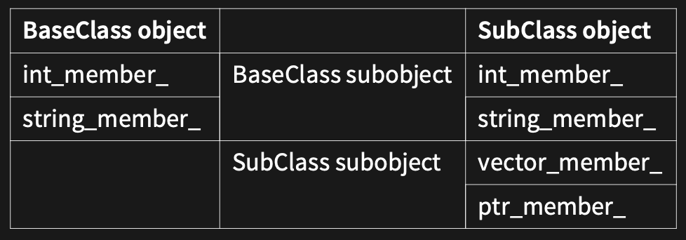

# w7lec2

Tags: lec
Status: Done
contents: dynamic polymorphism

***Inheritance*:** ability to create new classes based on existing ones

- supported by class derivation

***Polymorphism*:** allows objects of a subclass to be used as if they were objects of a base class

- if a class is inherited from another class, the inheritance can be passed as a class it inherited from
    - dog is inheritance of animal, if the parameter required is animal, dog can be passed as well
- supported via virtual functions

***Dynamic binding*:** run-time resolution of the appropriate function to invoke based on the type of the object

- Closely related to polymorphism
- Supported via virtual functions

### OO Tenets of C++

***Don’t pay for what you don’t use.***

- C++ support OOP
    - No runtime performance penalty
- C++ supports generic programming with the STL and templates
    - No runtime performance penalty
- Polymorphism is extremely powerful, and we need it in C++
    - Do we need polymorphism at all when using inheritance?
    - → Sometimes, but how do we do so, considering that we don’t want to make anyone who doesn’t use it pay a performance penalty

One of the guiding principles of C++ is “You don’t pay for what you don’t use”

# Inheritance In C++

```cpp
class BaseClass {
 public:
	 int get_int_member() { return int_member_; }
	 std::string get_class_name() {
		 return "BaseClass";
	 };
	 
 private:
	 int int_member_;
	 std::string string_member_;
}
```

```cpp
class SubClass: public BaseClass {
 public:
	 ***// OVERWRITING the baseclass member function***
	 std::string get_class_name() {
		 return "SubClass";
	 }
 
 private:
	 std::vector<int> vector_member_;
	 std::unique_ptr<int> ptr_member_;
}
```

To inherit off classes in C++, we use “class DerivedClass: public BaseClass”.

**Visibility can be one of:**

- ***public*:** generally use this unless you have good reason not to
    - if you don’t want public, you should (usually) use composition
- ***protected***
- ***private***

**Visibility is the maximum visibility allowed.**

- If you specify “: private BaseClass”, the the maximum visibility is private.
    
    → Any BaseClass members that were public or protected are now private.
    

**Memory layout**



## Code Exploration

```cpp
#include <string>
#include <iostream>

class BaseClass {
	public:
		int get_member() { return member_; }
		std::string get_class_name() {
			return "BaseClass";
		}
	private:
		int member_;
};

class SubClass: public BaseClass {
	public:
		std::string get_class_name() {
			(void) subclass_data_;
			return "SubClass";
		}
	
	private:
		int subclass_data_;
};

void print_class_name(BaseClass base) {
	std::cout << base.get_class_name()
						<< ' ' << base.get_member()
						<< '\n';
}

int main() {
	BaseClass base_class;
	SubClass subclass;
	
	print_class_name(base_class); // "BaseClass"
	
	// it hasn't been overwritten!!!!
	**print_class_name(subclass); // "BaseClass"**
}
```

But it does work if we print BaseClass and SubClass separately …

```cpp
#include <string>
#include <iostream>

class BaseClass {
	public:
		int get_member() { return member_; }
		std::string get_class_name() {
			return "BaseClass";
		}
	private:
		int member_;
};

class SubClass: public BaseClass {
	public:
		std::string get_class_name() {
			(void) subclass_data_;
			return "SubClass";
		}
	
	private:
		int subclass_data_;
};

void print_class_name(BaseClass base) {
	std::cout << base.get_class_name()
						<< ' ' << base.get_member()
						<< '\n';
}

void print_class_name2(SubClass sub) {
	std::cout << sub.get_class_name()
						<< ' ' << sub.get_member()
						<< '\n';
}

int main() {
	BaseClass base_class;
	SubClass subclass;
	
	print_class_name(base_class); // "BaseClass"
	**print_class_name(subclass); // "BaseClass"
	print_class_name2(subclass); // "SubClass"**
}
```

**Performance**

***Q*:** How many bytes is a BaseClass instance? How many bytes is a SubClass instance? How can the compiler allocate space for it on the stack, when it doesn’t know how big it could be?

***A*:** Since we care about performance, a BaseClass can only store a BaseClass, not a SubClass. If we try to fill that value with a SubClass, then it just fills it with the BaseClass sub-object and drops the SubClass sub-object.

***→ Object Slicing Problem***

***Solution*:** Use references/pointers (preferably references) to the BaseClass

```cpp
#include <string>
#include <iostream>

class BaseClass {
	public:
		int get_member() { return member_; }
		std::string get_class_name() {
			return "BaseClass";
		}
	private:
		int member_;
};

class SubClass: public BaseClass {
	public:
		std::string get_class_name() {
			(void) subclass_data_;
			return "SubClass";
		}
	
	private:
		int subclass_data_;
};

// it is referencing the entire object.
// although nothing being sliced or cut off here,
// we still calling the wrong function
void print_class_name(**BaseClass& base**) {
	std::cout << base.get_class_name()
						<< ' ' << base.get_member()
						<< '\n';
}

int main() {
	BaseClass base_class;
	SubClass subclass;
	print_class_name(base_class);
	print_class_name(subclass);
}
```

## More Problems

```cpp
class BaseClass {
	public:
		int get_member() { return member_; }
		std::string get_class_name() {
			return "BaseClass";
		}
	
	private:
		int member_;
};

class SubClass: public BaseClass {
	public:
		std::string get_class_name() {
			return "SubClass";
		}
	
	private:
		int subclass_data_;
}
```

```cpp
void print_class_name(BaseClass& base) {
	std::cout << base.get_class_name()
						<< ' ' << base.get_member()
						<< '\n';
}

int main() {
	BaseClass base_class;
	SubClass subclass;
	print_class_name(base_class);
	print_class_name(subclass);
}
```

How does the compiler decide which version of get_class_name to call?

- When does the compiler decide this? Compile or runtime?

How can it ensure that calling get_member doesn’t have similar overhead?

## Virtual & Override

```cpp
void print_stuff(const BaseClass& base) {
	std::cout << base.get_class_name << '\n';
}

int main() {
	SubClass subclass;
	print_stuff(subclass);
}
```

By default, C++ will call `get_class_name()` of the BaseClass.

However, if the base class has the function marked as virtual, it will happily look toward the derived class.

```cpp
class BaseClass {
	public:
		int get_number() { return member_; }
		**virtual** std::string get_class_name() {
			return "BaseClass";
		}
		
	private:
		int member_;
}
```

```cpp
class SubClass: public BaseClass {
	public:
		std::string GetClassName() **override** {
			return "SubClass";
		}
		
	private:
		int subclass_data_;
}
```

While **OVERRIDE** isn’t required by the compiler, ***you should ALWAYS use it***.

- when the function in BaseClass is marked as virtual, it will take an eye on whether there is a function overwriting it

Override fails to compile if the function doesn’t exist in the base class.

- Typos
- Refactoring
- Const / non-const methods
- Slightly different signatures

```coffeescript
class BaseClass {
	public:
		int get_number() { return member_; }
		
	private:
		int member_;
}

// if there is no function called GetClassName in the BaseClass,
// we can't override anything
// **error: only virtual member functions can be marked "override"**
class SubClass: public BaseClass {
	public:
		std::string GetClassName() **override** {
			return "SubClass";
		}
		
	private:
		int subclass_data_;
}
```

**static_cast**

```cpp
#include <iostream>
#include <string>

class BasicClass {
	public:
		virtual std::string get_class_name() const {
			return "BaseClass";
		}
		
		BasicClass() = default;
		
		virtual ~BasicClass() {
			std::cout << "Destructing base class\n";
		}
};

class SubClass: public BaseClass {
	public:
		std::string get_class_name() const override {
			return "SubClass";
		}
		
		SubClass() = default;
		
		~SubClass() {
			std::cout << "Destructing subclass\n";
		}
};

void print_stuff(const BasicClass basic_class) {
	std::cout << base_class.get_class_name() << '\n';
}

int main() {
	// - malloc a SubClass in the heap
	// - give it to a unique pointer
	// - casting from unqiue pointer of SubClass to a unique pointer of a BaseClass
	// => a BaseClass pointer to a SubClass
	auto subclass = static_cast<std::unique_ptr<BaseClass>>(
		std::make_unique<SubClass>());
		
	// break it up to two lines:
	SubClass s = std::make_unqiue<SubClass>();
	BaseClass b = static_cast<std::make_unique<BaseClass>>(s);
		
	// briefly same thing:
	SubClass* s = new SubClass;
	BaseClass* b = s;
	
	// also almost the same:
	SubClass s;
	BaseClass& b = s;
	
	std::cout << subclass->get_class_name();  // SubClass
}

// All printed out:
// SubClass
// Destructing subclass
// Destructing baseclass
```

```cpp
#include <iostream>
#include <string>

class BasicClass {
	public:
		virtual std::string get_class_name() const {
			return "BaseClass";
		}
		
		BasicClass() = default;
		
		virtual ~BasicClass() {
			std::cout << "Destructing base class\n";
		}
};

class SubClass: public BaseClass {
	public:
		std::string get_class_name() const override {
			return "SubClass";
		}
		
		SubClass() = default;
		
		~SubClass() {
			std::cout << "Destructing subclass\n";
		}
};

void print_stuff(const BasicClass basic_class) {
	std::cout << base_class.get_class_name() << '\n';
}

int main() {
	auto s = SubClass{};
	auto b = static_cast<BaseClass>(s);	
}
// -- static_cast: destruct the subclass
// Destructing base class
// Destructing subclass
// -- out of scope: destruct base class
// Destructing base class
```

## Vtables

Each class has a **VTable stored in the data segment**.

- ***A vtable is an array of function pointers that says which definition each virtual function points to for that class***

If the VTable for a class is non-empty, then every member of that class has an additional data member that is a pointer to the table.

When a virtual function is called on a reference or pointer type, then the program actually does the following.

1. Follow the vtable pointer to get to the vtable
2. Increment by an offset, which is a constant for each function
3. Follow the function pointer at vtable[offset] and call the function


```cpp
class Polygon {
public:
	virtual int sides() { return 0; }
	virtual int area() { return 0; }
	
private:	
	int height_;
	int width_;
}

class Triangle: public Polygon {
public:
	int sides() override {
		return 3;
	}
	int area() override {
		return height * width / 2;
	}
}

class Rectangle: public Polygon {
public:
	int sides() override {
		return 4;
	}
	int area() override {
		return height * width;
	}
}
```

## Final

Specifies to the compiler “***this is not virtual for any subclasses***”

- **NO MORE FURTHER OVERRIDING**

If the compiler has a variable of type SubClass&, it now no longer needs to look it up in the vtable.

This means static binding if you have a SubClass&, but dynamic binding for BaseClass&.

```cpp
class BaseClass {
	public:
		int get_member() { return member_; }
		virtual std::string get_class_name() {
			return "BaseClass";
		}
		
	private:
		int member_;
}
```

```cpp
class SubClass: public BaseClass {
	public:
		std::string get_class_name() override **final** {
			return "SubClass";
		}
	
	private:
		int subclass_data_;
}
```

| Syntax | Name | Meaning |
| --- | --- | --- |
| `virtual void fn() = 0;` | pure virtual | Inherit interface only |
| `virtual void fn()` | virtual | Inherit interface with optional implementation |
| `void fn()` | non-virtual | Inherit interface and mandatory implementation |

**Note:** non-virtual’s can be hidden by writing a function with the same name in a subclass —— **DONOT DO THIS!!!**

## Abstract Base Classes (ABCs)

Might want to deal with a base class, but the base class by itself is nonsense

- What is the default way to draw a shape? How many sides by default?
- A function takes in a “Clickable”

Might want some default behaviour and data, but need others

- All files have a name, but are reads done over the network or from a disk

***If a class has at least one “abstract” (pure virtual in C++) method, the class is abstract and cannot be constructed.***

- It can, however, have constructors and destructors
- These provide semantics for constructing and destructing the ABC sub-object of any derived classes

## Pure Virtual Functions

Virtual functions are good for when you have a default implementation that subclassed may want to overwrite.

Sometimes there is no default available.

A pure virtual function specifies a function that a class must override in order to not be abstract.

```cpp
class Shape {
	// Your derived class "Circle" may forget to write this
	virtual void draw(Canvas&) {}
	
	// Fails at link time because there's no definition.
	// - This is only a declaration.
	// - If this hasn't been defined somewhere else, it will fail to compile
	virtual void draw(Canvas&);
	
	// Pure virtual function
	virtual void draw(Canvas&) = 0;
};
```

# Polymorphic Objects

## Create Polymorphic Objects

In a language like Java, everything is a pointer.

- This allows for code like on the left
- Not possible in C++ due to objects being stored inline, which then leads to slicing problem

```java
// java use reference for everything, 
// we just don't need to look at it
ArrayList<Polygon> ar;
ar.push(new Triangle());
ar.push(new Rectangle());
ar.push(new Triangle());
ar.push(new Rectangle());
```

```cpp
// Java-style C++ code
// DONT DO THIS!!!

// In C++, BaseClass{} returns a actual value instead of a reference
auto base = std::vector<BaseClass>();
base.push_back(BaseClass{});
base.push_back(SubClass1{});
base.push_back(SubClass2{});
```

If you want to store a polymorphic object, **USE A POINTER**.

```cpp
// Good C++ code
// But there's a potential problem here

auto base = std::vector<std::unqiue_ptr<BaseClass>>();
base.push_back(std::make_unique<BaseClass>());
base.push_back(std::make_unique<SubClass1>());
base.push_back(std::make_unique<SubClass2>());
```

### Inheritance and Constructors

***Every subclass constructor MUST CALL a base class constructor*** 

- If none is manually called, the default constructor is used
- A subclass cannot initialise fields defined in the base class
- Abstract classes must have constructors

```cpp
class BaseClass {
public:
	BaseClass(int member): int_member_{member} {}
	
private:
	int int_member_;
	std::string string_member_;
}

class SubClass: public BaseClass {
public:
	SubClass(int member, std::unqiue_ptr<int>&& ptr)
	: **BaseClass(member)**
	, ptr_member_(std::move(ptr)) {}
	
	// won't compile.
	SubClass(int member, std::unqiue_ptr<int>&& ptr)
	: int_member_(member)
	, ptr_member_(std::move(ptr)) {}

private:
	std::vector<int> vector_member_;
	std::unique_ptr<int> ptr_member_;
}
```

## Destruct Polymorphic Objects

```cpp
// simplification of previous slides code
auto base = std::make_unique<BaseClass>();
auto subclass = std::make_unique<SubClass>();
```

Whenever you write a class intended to be inherited from, **ALWAYS MAKE YOUR DESTRUCTOR VIRTUAL**.

Remember: When you declare a destructor, the move constructor and assignment are not synthesised.

- Forgetting this can be a hard bug to spot!!!!

```cpp
class BaseClass {
	BaseClass(BaseClass&&) = default;
	BaseClass& operator=(BaseClass&&) = default;
	virtual ~BaseClass() = default;
}
```

# Static & Dynamic Types

**Static type:** the type it is declared as

**Dynamic type:** the type of the object itself

Static means compile-time and dynamic means runtime.

```cpp
int main() {
	auto base_class = BaseClass(); // s=Base, d=Base
	auto subclass = SubClass(); // s=Sub, d=Sub
	auto sub_copy = SubClass(); // s=Sub, d=Sub
	
	// The following could all be replaced with pointers and have the same effect
	const BaseClass& base_to_base{base_class}; // s=Base, d=Base
	
	// Another reason to use auto - you can't accidentally do this
	const BaseClass& base_to_sub{subclass}; // s=Base, d=Sub
	
	// Fails to compile
	// we can't create a triangle(subclass) referenced to a polygon(base class)
	const SubClass& sub_to_base{base_class}; // s=Sub, d=Base
	const SubClass& sub_to_sub{subclass}; // s=Sub, d=Sub
	
	// Fails to compile (even though it refers to at a sub)
	const SubClass& sub_to_base_to_sub{base_to_sub};
}
```

Due to ***object slicing***, an object that is neither reference or pointer always has the same static and dynamic type.

```cpp
int main() {
	auto base_class = BaseClass(); // s=Base, d=Base
	auto subclass = SubClass(); // s=Sub, d=Sub
	auto sub_copy = SubClass(); // s=Sub, d=Sub
	
	// since we are copy a subclass object into a base class object
	// the part in subclass not in baseclass get cut off,
	// what left is only the base class part.
	// So there is no difference between static type and dynamic type here,
	// they are all subclass.
	const BaseClass frog{subclass}; // s=base, d=base
}
```

**Static binding:** Decide which function to call at compile time (based on static type)

**Dynamic binding:** Decide which function to call at runtime (based on dynamic type)

**C++:**

- Statically typed (types are calculated at compile time)
- Static binding for non-virtual functions
- Dynamic binding for virtual functions

**Java:**

- Statically typed
- Dynamic binding

## Up-casting

Casting from a derived class to a base class is called up-casting.

This cast is ***always safe***.

- All dogs are animals

Because the case is always safe, C++ allows this as an implicit cast.

One of the reasons to use auto is that it avoids implicit casts.

```cpp
auto dog = Dog();
Animal& animal = dog;
Animal* animal = &dog;
```

## Down-casting

Casting from a base class to derived class is called down-casting.

This cast is ***not safe***.

- Not all animals are dogs

```cpp
auto dog = Dog();
auto cat = Cat();

// up-cast cat and dog to animal_cat and animal_dog
Animal& animal_dog{dog};
Animal& animal_cat{cat};

// Attempt to down-cast with references.
// Neither of these compile.
// Why not?
// -> All these compilation should be done statically.
// -> At the stage we do compilation, 
//      the compiler doesn't think that deep about what it actually is (dynamic type).
// -> What the compiler considering is we are trying to down-cast a animal to a dog/cat,
//      which is not safe.
Dog& dog_ref{animal_dog};
Dog& dog_ref{animal_cat};
```

**How to down cast?**

The compiler doesn’t know if an Animal happens to be a Dog.

- If you know it is, you can use `static_cast`
- Otherwise, you can use `dynamic_cast`
    - Returns null pointer for pointer types if it doesn’t match
    - Throws exceptions for reference types if it doesn’t match

```cpp
auto dog = Dog();
auto cat = Cat();
Animal& animal_dog{dog};
Animal& animal_cat{cat};

// Attempt to down-cast with references.
Dog& dog_ref{static_cast<Dog&>(animal_dog)};
Dog& dog_ref{dynamic_cast<Dog&>(animal_dog)};
// Undefined behaviour (incorrect static cast)
Dog& dog_ref{static_cast<Dog&>(animal_cat)};
// Throws exception
Dog& dog_ref{dynamic_cast<Dog&>(animal_cat)};
```

```cpp
auto dog = Dog();
auto cat = Cat();
Animal& animal_dog{dog};
Animal& animal_cat{cat};

// Attempt to down-cast with pointers.
Dog* dog_ptr{static_cast<Dog*>(&animal_dog)};
Dog* dog_ptr{dynamic_cast<Dog*>(&animal_dog)};
// Undefined behaviour (incorrect static cast)
Dog* dog_ptr{static_cast<Dog*>(&animal_cat)};
// returns null pointer
Dog* dog_ptr{dynamic_cast<Dog*>(&animal_cat)};
```

# Covariance and Contra-variance

https://en.wikipedia.org/wiki/Covariance_and_contravariance_(computer_science)

## Covariants

**Q: If a function overrides a base, which type can it return?**

**A:** If a base specifies that it returns a LandAnimal, a derived also needs to return a LandAnimal.

Every possible return type for the derived must be a valid return type for the base.

```cpp
class Base {
	virtual LandAnimal& get_favourite_animal();
};

class Derived: public Base {
	// return type is subclass is base class of return type in base class
	// return type: LandAnimal& -> Animal&
	// **Fails to compile**: Not all animals are land animals.
	Animal& get_favourite_animal() override;
	
	// return type in subclass is the same as in base class
	// return type: LandAnimal& -> LandAnimal&
	// **Compiles**: All land animals are land animals.
	LandAnimal& get_favourite_animal() override;
	
	// return type in subclass is subclass of return type in baseclass
	// return type: LandAnimal& -> Dog&
	// **Compiles**: All dogs are land animals.
	Dog& get_favourite_animal() override;
};
```

## Contravariants

**Q: If a function overrides a base, which types can it take in?**

**A:** If a base specifies that it takes in a LandAnimal, a LandAnimal must always be valid input in the derived.

Every possible parameter to the base must be a possible parameter for the derived.

```cpp
class Base {
	virtual void use_animal(LandAnimal&);
};

class Derived: public Base {
	// parameter: LandAnimal& -> Animal&
	// Compiles: All land animals are valid input (animals).
	void use_animal(Animal&) override;
	
	// parameter: LandAnimal& -> LandAnimal&
	// Compiles: All land animals are valid input (land animals).
	void use_animal(LandAnimal&) override;
	
	// parameter: LandAnimal& -> Dog&
	// Fails to compile: Not all land animals are valid input (dogs).
	void use_animal(Dog&) override;
};
```

## Default Arguments And Virtual

Default arguments are determined at compile time for efficiency’s sake.

Hence, ***default arguments need to use the static type of the function***.

***AVOID DEFAULT ARGUMENTS* when overriding virtual functions.**

```cpp
#include <iostream>

class Base {
public:
	virtual ~Base() = default;
	virtual void print_num(int i = 1) {
		std::cout << "Base " << i << '\n';
	}
};

class Derived: public Base {
public:
	void print_num(int i = 2) override {
		std::cout << "Derived " << i << '\n';
	}
};

int main() {
	Derived derived;
	Base* base = &derived;
	
	// The dynamic type for those two are the same,
	// so they are expected to print out the same as well.
	// Why not?
	// ***The default argument is based on the static type***, not the dynamic type.
	derived.print_num(); // Prints "Derived 2"
	base->print_num(); // Prints "Derived 1"
}
```

## Construction Of Derived Classes

Base classes are always constructed before the derived class is constructed

- The base class ctor never depends on the members of the derived class
- The derived class ctor may be dependent on the members of the base class

```cpp
class Animal {...}
class LandAnimal: public Animal {...}
class Dog: public LandAnimal {...}

Dog d;

/**
- Dog() calls LandAnimal()
	-> LandAnimal() calls Animal()
		--> Animal members constructed using initialiser list
		--> Animal constructor body runs
	-> LandAnimal members constructed using initialiser list
	-> LandAnimal constructor body runs
- Dog members constructed using initialiser list
- Dog constructor body runs
*/
```

## Virtual In Constructors

If a class is not fully constructed, cannot perform dynamic binding.

```cpp
class Animal {...};
class LandAnimal: public Animal {
	LandAnimal() {
		Run();
	};
	
	virtual void Run() {
		std::cout << "Land animal running" << '\n';	
	}
};
class Dog: public LandAnimal {
	void Run() override {
		std::cout << "Dog running" << '\n';
	}
};

// When the LandAnimal constructor is being called,
// the Dog part of the object has not been constructed yet.
// C++ chooses not to allow dynamic binding in constructors
// because Dog::Run() might depend upon Dog's members.
Dog d;
```

## Destruction of Derived Classes

Easy to remember order: Always opposite to construction order

```cpp
class Animal {...};
class LandAnimal: public Animal {...};
class Dog: public LandAnimal {...};

auto d = Dog();

/** 
~Dog() destructor body runs
	-> Dog members destructed in reverse order of declaration
		--> ~LandAnimal() destructor body runs
		--> LandAnimal members destructed in reverse order of declaration
	-> ~Animal() destructor body runs
Animal members destructed in reverse order of declaration	
*/

```

## Virtual In Destructors

If a class is partially destructed, cannot perform dynamic binding.

Unrelated to the destructor itself being virtual.

```cpp
class Animal {...};
class LandAnimal: public Animal {
	virtual ~LandAnimal() {
		Run();
	}
	virtual void Run() {
		std::cout << "Land animal running" << '\n';
	}
};
class Dog: public LandAnimal {
	void Run() override {
		std::cout << "Dog running" << '\n';
	}
};

// When the LandAnimal constructor is being called,
// the Dog part of the object has already been destroyed.
// C++ chooses to not allow dynamic binding in destructors
// because Dog::Run() might depend upon Dog's members.
auto d = Dog();
```