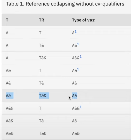

# w9lec

Tags: lec
Status: Done
contents: decltype; type transformation; binding; constexpr; variadic

# Decltype

Semantic equivalent of a “typeof” function for C++

***Rule1***: if expression e is any of:

- variable in local scope
- variable in namespace scope
- static member variable
- function parameters

then result is variable/parameter type T

***Rule2***: if e is an lvalue(i.e. reference), result is T&

***Rule3***: if e is an xvalue, result is T&&

***Rule4***: if e is prvalue, result is T

```cpp
int i;
int& j = i;

decltype(i) x; // int - variable
decltype((j)) y; // int& - lvalue
decltype(5) z; // int - prvalue
```

### Determining return types

Iterator used over templated collection and returns a reference to an item at a particular index

```cpp
template <typename It>
??? find(It beg, It end, int index) {
	for (auto it = beg, int i = 0; beg != end; ++it, ++i) {
		if (i == index) return *it;
	}
	return end;
}
```

We know the return type should be decltype(*beg), since we know the type of what is returned is of type *beg.

This will not work, as beg us not declared until after reference to beg …

```cpp
template <typename It>
auto find(It beg, It end, int index) -> decltype(*beg) {
	for (auto it = beg, int i = 0; beg != end; ++it, ++i) {
		if (i == index) return *it;
	}
	return end;
}
```

# Type Transformation

A number of add, remove, and make functions exist as part of type traits that provide an ability to transform types.

```cpp
#include <iostream>
#include <type_traits>

template<typename T1, typename T2>
auto print_is_same() -> void {
	std::cout << std::is_same<T1, T2>() << "\n";
}

auto main() -> int {
	std::cout << std::boolalpha;
	print_is_same<int, int>(); // true
	print_is_same<int, int&>(); // false
	print_is_same<int, int&&>(); // false
	print_is_same<int ,std::remove_reference<int>::type>(); // true
	print_is_same<int ,std::remove_reference<int&>::type>(); // true
	print_is_same<int ,std::remove_reference<int&&>::type>(); // true
	print_is_same<int ,std::remove_reference<const int&&>::type>(); // true
}
```

```cpp
#include <iostream>
#include <type_traits>

auto main() -> int {
  using A = std::add_rvalue_reference<int>::type;
  using B = std::add_rvalue_reference<int&>::type;
  using C = std::add_rvalue_reference<int&&>::type;
  using D = std::add_rvalue_reference<int*>::type;

  std::cout << std::boolalpha;
  std::cout << "typedefs of int&&:" << "\n";
  std::cout << "A: " << std::is_same<int&&, A>::value << "\n"; // true
  std::cout << "B: " << std::is_same<int&&, B>::value << "\n"; // false
  std::cout << "C: " << std::is_same<int&&, C>::value << "\n"; // true
  std::cout << "D: " << std::is_same<int&&, D>::value << "\n"; // false
}

```



Since cpp14/cpp17 you can use shortened type trait names.

```cpp
#include <iostream>
#include <type_traits>

auto main() -> int {
  using A = std::add_rvalue_reference<int>;
  using B = std::add_rvalue_reference<int&>;
  
  std::cout << std::boolalpha;
  std::cout << "typedefs of int&&:" << "\n";
  std::cout << "A: " << std::is_same_v<int&&, A> << "\n";
  std::cout << "B: " << std::is_same_v<int&&, B> << "\n";
}

```

# Binding


```cpp
// here's a T& (lvalue reference), 
// so we can only pass lvalue according to the table abpve
void inc(int& a) {
	a += 1;
}

int main() {
	int num = 0;
	inc(num);
	// inc(4); // error since 4 is a rvalue
	const int num2 = 0;
	// inc(num2); // error since num2 is a const lvalue
}
```

```cpp
// const T& can take everything
void inc(const int& a) {
	return a;
}

int main() {
 int num = 0;
 const int num2 = 0;
 inc(num);
 inc(num2);
 inc(4);
}
```

```cpp
// template T&& can take everything as well
template <typename T>
void inc(T&& a) {
	a += 1;
}
```

```cpp
#include <iostream>

auto print(std::string const& a) -> void {
  std::cout << a << "\n";
}

auto goo() -> std::string const {
  return "C++";
}

auto main() -> int {
  auto j = std::string{"C++"};
  auto const& k = "C++";
  print("C++"); // rvalue
  print(goo()); // rvalue
  print(j); // lvalue
  print(k); // const lvalue
}
```

```cpp
#include <iostream>

template<typename T>
auto print(T&& a) -> void {
  std::cout << a << "\n";
}

auto goo() -> std::string const {
  return "Test";
}

auto main() -> int {
  auto j = int{1};
  auto const& k = 1;

  print(1); // rvalue,       foo(int&&)
  print(goo()); // rvalue    foo(const int&&)
  print(j); // lvalue        foo(int&)
  print(k); // const lvalue  foo(const int&)
}
```

# constexpr

We can provide default arguments to template types (where the defaults themselves
are types)
It means we have to update all of our template parameter lists
Either:
- **A variable that can be calculated at compile time**
- A function that, if its inputs are known at compile time, can be run at compile time

```cpp
#include <iostream>

constexpr int constexpr_factorial(int n) {
  return n <= 1 ? 1 : n * constexpr_factorial(n - 1);
}

int factorial(int n) {
  return n <= 1 ? 1 : n * factorial(n - 1);
}

auto main() -> int {
  // Beats a #define any day.
  constexpr int max_n = 10;
  constexpr int tenfactorial = constexpr_factorial(10);

  // This will fail to compile
  int ninefactorial = factorial(9);

  std::cout << max_n << "\n";
  std::cout << tenfactorial << "\n";
  std::cout << ninefactorial << "\n";
}
```

Benefits:
- Values that can be determined at compile time mean less processing is needed at
runtime, resulting in an overall faster program execution
- Shifts potential sources of errors to compile time instead of runtime (easier to
debug)

# Variadic

```cpp
#include <iostream>
#include <typeinfo>

template <typename T>
auto print(const T& msg) -> void {
  std::cout << msg << " ";
}

template <typename A, typename... B>
auto print(A head, B... tail) -> void {
  print(head);
  print(tail...);
}

auto main() -> int {
  print(1, 2.0f);
  std::cout << "\n";
  print(1, 2.0f, "Hello");
  std::cout << "\n";
}
```

```cpp
// this is how it happens
auto print(const char* const& c) -> void {
	std::cout << c << " ";
}
auto print(float const& b) -> void {
	std::cout << b << " ";
}
auto print(float b, const char* c) -> void {
	print(b);
	print(c);
}
auto print(int const& a) -> void {
	std::cout << a << " ";
}
**auto print(int a, float b, const char* c) -> void {
	print(a);
	print(b, c);
}**
```

```cpp
// typename... Args: template parameter pack
// Args... args: function parameter pack
// we can use recursive call to unpack all the arguments
template <typename T, typename... Args>
T adder(T first, Args... args) {
	// it will recursively call adder with arguments left
	return first + adder(args...);
}

```